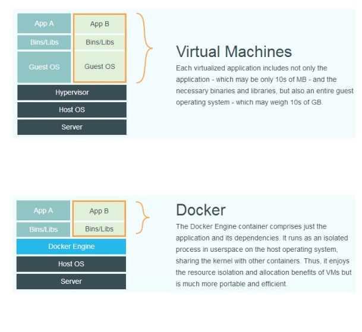

#### Docker-从入门到实践

Docker是一个划时代的项目，彻底释放了计算虚拟化的威力，极大提高了应用的维护效率、降低了云计算
应用开发的成本。使用Docker使得应用的部署、测试和分发都变得轻松和高效。

- Docker简介

     传统虚拟机技术是虚拟出一套硬件之后，在其上运行一个完整的操作系统，在该操作系统上
     再运行所需应用进程；而容器内的应用进程直接运行于宿主的内核，容器内没有自己的内核，
     而且也没有进行硬件虚拟。因此容器相比传统虚拟机更为轻便。
     
     
     由于不需进行硬件虚拟以及运行完整的操作系统，Docker对系统的利用率更高。开发过程中
     常见的问题就是环境一致性问题。由于开发环境、测试环境、生产环境不一致，导致有些
     bug在开发过程未被发现。Docker的镜像提供了除内核外完整的运行时环境，保证了应用的
     环境一致性。
     
     对于开发和运维人员来说，最希望的就是一次创建或配置，可以在任意地方正常运行。使用Docker
     可以通过定制应用镜像来实现持续集成、持续交付、部署。
     
     - 基本概念
     
        Docker包括三个基本概念
        
        - 镜像（Image）
        - 容器（Container）
        - 仓库（Repository）
        
        理解了这三个概念，就理解了Docker的整个生命周期。
        
     - Docker镜像
     
        操作系统分为内核和用户空间。对Linux而言，内核启动后，会挂载root文件为其提供用户空间
        支持。而Docker镜像（Image），就相当于一个root文件系统，除了运行时所需的程序、库、资源、
        配置等文件外，还包含了一些为运行时准备的一些配置参数。镜像不包含任何动态数据，其内容
        在构建之后也不会被改变。
        
     - Docker容器
     
        镜像与容器的关系，就像是类与实例一样。镜像是静态的定义，容器是镜像运行时的实体。容器
        可以被创建、启动、停止、删除、暂停等。
    
     - Docker Registry
     
        镜像构建完成后，可以很容易在当前宿主机上运行，但是，如果需要在其他服务器上使用这个镜像，
        我们就需要一个集中的存储、分发镜像的服务，Docker Registry就是这样的服务。一个Docker
        Registry中可以包含多个仓库（Repository）；每个仓库可以包含多个标签（Tag）；每个标签
        对应一个镜像。以Ubuntu镜像为例，ubuntu是仓库的名字，16.04、18.04是标签。我们可以通过
        ubuntu：14.04来指定需要的镜像。
        
 - 安装Docker
 
    Docker分为CE和EE两大版本，CE是社区版，免费。EE是企业版，付费。国内的话需要在settings中的daemon
    里需要配置国内的镜像地址https://registry.docker-cn.com。输入docker info看输出的信息是否更换了
    Registry Mirrors
    
 - 使用Docker镜像
    
    Docker运行容器需要在本地存在的镜像，如果不存在则会去镜像仓库下载
    
    从仓库中下载镜像的命令是`docker pull [options] [Docker Registry address[:port/]registry name[:tag]`
    
    例如：`docker pull ubuntu:18.04`
    
- 运行
    
   运行上面刚刚的ubuntu，` docker run -it --rm ubuntu18:04 bash`，docker run就是运行容器的命令，具体格式
   我们会在容器一节进行详细讲解。
   ```
    -it  ：这是两个参数，一个是  -i  ：交互式操作，一个是  -t  终端。我们
    这里打算进入  bash  执行一些命令并查看返回结果，因此我们需要交互式终
    端。
    --rm  ：这个参数是说容器退出后随之将其删除。默认情况下，为了排障需
    求，退出的容器并不会立即删除，除非手动  docker rm  。我们这里只是随便
    执行个命令，看看结果，不需要排障和保留结果，因此使用  --rm  可以避免
    浪费空间。
    ubuntu:18.04  ：这是指用  ubuntu:18.04  镜像为基础来启动容器。
    bash  ：放在镜像名后的是命令，这里我们希望有个交互式 Shell，因此用的
    是  bash  。
   ```
   
- 列出镜像
    ```
    docker image ls
    REPOSITORY          TAG                 IMAGE ID            CREATED             SIZE
    ubuntu              18.04               47b19964fb50        7 weeks ago         88.1MB
    ```
    依次列出了仓库名、标签、镜像ID、创建时间和镜像大小。镜像ID是一个唯一标识符
    
- 删除本地镜像

    如果要删除本地镜像，可以使用`docker image rm imagename`命令，其中image可以是镜像的id、镜像名、镜像摘要。
    其中镜像id一般只列出前三位即可。
    ```
    > docker image rm 47b
    Untagged: ubuntu:18.04
    Untagged: ubuntu@sha256:7a47ccc3bbe8a451b500d2b53104868b46d60ee8f5b35a24b41a86077c650210
    Deleted: sha256:47b19964fb500f3158ae57f20d16d8784cc4af37c52c49d3b4f5bc5eede49541
    Deleted: sha256:d4c69838355b876cd3eb0d92b4ef27b1839f5b094a4eb1ad2a1d747dd5d6088f
    Deleted: sha256:1c29a32189d8f2738d0d99378dc0912c9f9d289b52fb698bdd6c1c8cd7a33727
    Deleted: sha256:d801a12f6af7beff367268f99607376584d8b2da656dcd8656973b7ad9779ab4
    Deleted: sha256:bebe7ce6215aee349bee5d67222abeb5c5a834bbeaa2f2f5d05363d9fd68db41
    ```
    观察输出日志分为两类，一类是Untagged，另一类是Deleted。镜像的唯一标识是其ID和摘要，而一个镜像可以
    拥有多个标签。因此当我们使用上面的标签删除镜像的时候，实际上是在要求删除某个标签的镜像。所以首先需要
    做的就是将满足我们要求的所有镜像的标签都取消，这就是看到的Untagged信息。因为一个镜像可以对应多个标签，
    当删除了指定的标签之后，可能还有别的标签指向这个镜像，如果是这种情况，那Delete行为就不会发生。而仅仅
    只是删除了一些标签而已。
    
    当所有标签被删除后，会触发删除行为。镜像是多层存储结构，因此在删除的时候也是先上层向基础层方向
    依次进行判断删除。镜像的多层结构让复用变动变得非常态容易
    
 - 镜像的构建
 
    下载并运行一个nginx镜像`docker run --name webserver -d -p 80:80 nginx`
    这条命令是以nginx镜像启动了一个名字叫做webserver的容器，并且映射了80端口，直接在浏览器输入
    http://localhost:80就能看到Nginx的启动页面。
    
    如果我们不喜欢初始的启动页`docker exec -it webserver bash`，我们将会以终端的形式进入webserver容器，
    并执行了bash命令，也就是获得了一个可执行的Shell。然后进入到`/usr/shar/nginx/html`目录，执行
    `echo '<h1>Hello Docker</h1>' > index.html`。我们重新覆盖了首页的内容，刷新浏览器就能看到变化。
    
    修改了容器的文件，也就是修改了容器的存储层，通过`docker diff`可以看到具体的改动。
    ```
    > docker diff webserver
    C /root
    A /root/.bash_history
    C /usr
    C /usr/share
    C /usr/share/nginx
    C /usr/share/nginx/html
    C /usr/share/nginx/html/index.html
    C /var
    C /var/cache
    C /var/cache/nginx
    A /var/cache/nginx/scgi_temp
    A /var/cache/nginx/uwsgi_temp
    A /var/cache/nginx/client_temp
    A /var/cache/nginx/fastcgi_temp
    A /var/cache/nginx/proxy_temp
    C /run
    A /run/nginx.pid
    ```
    我们对任何文件做的修改都会被记录于容器存储层里，而Docker提供了`docker commit`命令，可以将容器的额存储层
    保存下来成为镜像，就是在原有镜像的基础上，再叠加上容器的存储层，构成新的镜像。
    ```
    > docker commit --author "zhu jiacheng" --message "update index.html" webserver nginx:v2
    sha256:7195d62f4de01c14d245e4be18f0c6fb97a5fe71a65f29e23e581ea4416cd491
    
    > docker image ls
    REPOSITORY          TAG                 IMAGE ID            CREATED             SIZE
    nginx               v2                  7195d62f4de0        26 seconds ago      109MB
    nginx               latest              881bd08c0b08        3 weeks ago         109MB
    
    > docker run --name web2 -d -p 81:80 nginx:v2
    6208d4bd90364ca13794379b0e2bf2bdb0bd7569f1883affe0cec7a3395dd960
    ```
    我们将变动提交之后重新启动，将新的容器80端口映射到了本地的81，在浏览求输入http://localhost:81就能看到
    新的启动页。
    
    但是要慎用docker commit功能，因为生成的新镜像很难追踪到具体是做了哪些修改。
    
- 使用Dockerfile定制镜像

    通过docker commit的学习，镜像的定制就是为每一层添加配置、文件，我们可以把每一层修改、安装
    、构建、操作的命令都写入一个脚本，用这个脚本来构建、定制镜像，那么之前所提到的镜像无法重复、镜像
    构建透明性的问题都会解决。这个脚本就是Dockerfile。
    
    Dockerfile是一个文本文件，其内包含了一条条的指令（instruction），每一条指令构建一层。因此每一条
    指令的内容就是描述该层应如何构建。
    
    在本地的文件夹中新建一个Dockerfile文件
    ```
    FROM nginx
    RUN echo '<h1>Hello, Docker!</h1>' > /usr/share/nginx/html/index.html
    ```
    保存之后在当前目录下执行
    ```
    > docker build -t nginx:v3 .
    
    > docker image ls
    REPOSITORY          TAG                 IMAGE ID            CREATED             SIZE
    nginx               v3                  897922b7c447        7 minutes ago       109MB
    nginx               v2                  7195d62f4de0        About an hour ago   109MB
    nginx               latest              881bd08c0b08        3 weeks ago         109MB
    ```
    此时镜像就构建完毕。
    
    Docker在运行时分为Docker引擎（即服务端的守护进程）和客户端工具。Dicker引擎提供了一组REST API，
    我们通过API与Docker引擎交互。当我们进行镜像构建时，并非所有定制都会通过RUN指令完成，经常需要
    将一些本地文件复制进镜像。比如COPY指令、ADD指令，docker build指令构建镜像，并非在本地构建，而是在
    服务端，也就是Docker引擎中构建，服务端如何获取本地文件呢。这就引入了上下文的概念。
    
    。当构建的时候，用户会指定构建镜像上下文的路径， docker build  命令得知这个路径后，会将路径下的所有内容打包，然后上
    传给 Docker 引擎。这样 Docker 引擎收到这个上下文包后，展开就会获得构建镜像所需的一切文件。
    
 - Dockerfile指令详解
 
    略
    
- 操作Docker容器

    Docker容器是Docker的另一个核心概念。简单地说，容器是一个独立运行的一个或一组应用，以及他们的
    运行态环境。
    
    - 启动容器
    
        启动容器有两种方式，一种是基于镜像新建一个容器并启动，另一种是将在终止状态（stopped）的容器重新启动。因为
        容器太轻量级了，所以很多用户都是随时删除和新创建容器。
        
        当利用docker run启动容器时，Docker在后台运行的标准操作包括：
        - 检查本地是否存在指定的镜像，不存在就从公有仓库下载
        - 利用镜像创建并启动一个容器
        - 分配一个文件系统，并在只读的镜像层外面挂载一层可读写层
        - 从宿主主机配置的网桥接口中桥接一个虚拟接口到容器中去e
        - 从地址池配置一个 ip 地址给容器
        - 执行用户指定的应用程序
        - 执行完毕后容器被终止
        
        利用docker container start可以将一个已经终止的容器启动运行。
        
    很多时候需要让Docker在后台运行而不是直接把执行命令的结果输出在当前宿主机下。此时可以添加`-d`参数来实现。
    
    利用`docker container ls`可以列举出正在运行的容器。
    
    - 终止容器
    
    通`过docker container stop`来终止一个运行中的容器，终止状态的容器可以通过
    `docker container ls -a`查看
    
    - 导出容器
    
        如果需要导出某个容器，可以使用`docker export`命令。`docker export 7691a814370e > ubuntu.tar`这样就可以
        导出容器快照到本地文件中。
    - 导入容器
    
        使用`docker import`从容器快照文件中再导入为镜像。
    - 删除容器
        
        使用`docker container rm`来删除一个处于终止状态的容器，如果要删除一个运行中的，则需要添加一个`-f`参数。
        
    - 清除所有处于终止状态的容器
    
        `docker container ls -a`会列出所有已创建包括处于终止状态的容器。如果需要一次性清理所有终止的
        容器可以执行`docker container prune`
        
    - 访问仓库
    
        仓库（Repository）是集中存放镜像的地方。一个容易混淆的概念是注册服务器（Registry）。实际上
        注册服务器是管理仓库的具体服务器。一个服务器上可以有多个仓库。不过大部分时候不需要严格区分这两个
        概念。
        

        
        
        
    
        
    
    
    