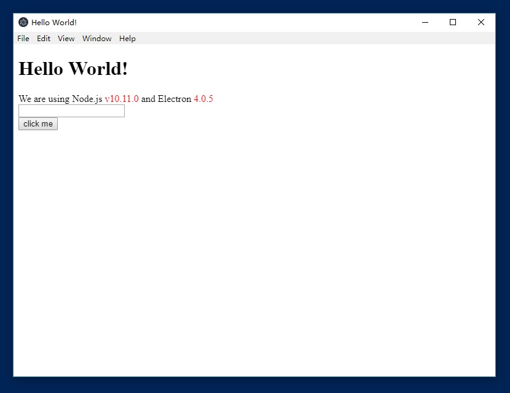

- 安装Electron
 
  通过npm`npm install electron -g`
  
- 第一个例子

  一个基本的Electron-demo的目录结构如下
  ```
    electron-demo/
    ├── package.json
    ├── main.js
    └── index.html
  ```
  在electron里，运行[package.json](electron-quick-start-demo/package.json)里面main脚本的进程成为主进程。
  主进程控制整个应用的生命周期，在主进程中可以创建Web形式的GUI。
  
  每个electron页面都运行着自己的进程，称为渲染进程。
  
  创建[main.js](electron-quick-start-demo/main.js)和[index.html](electron-quick-start-demo/index.html)
  - 运行
  通过`electron .`来启动项目
  
  
  - 打包
  
  应该开发完成需要打包，常用的打包工具有 electron-packager 和 asar。
  这里以 electron-packager 为例。
  
  首先全局安装electron-packager：`npm install electron-packager -g`
  然后在项目中安装 electron：` npm install electron --save-dev`
  然后打包：`electron-packager . electron-demo`
  