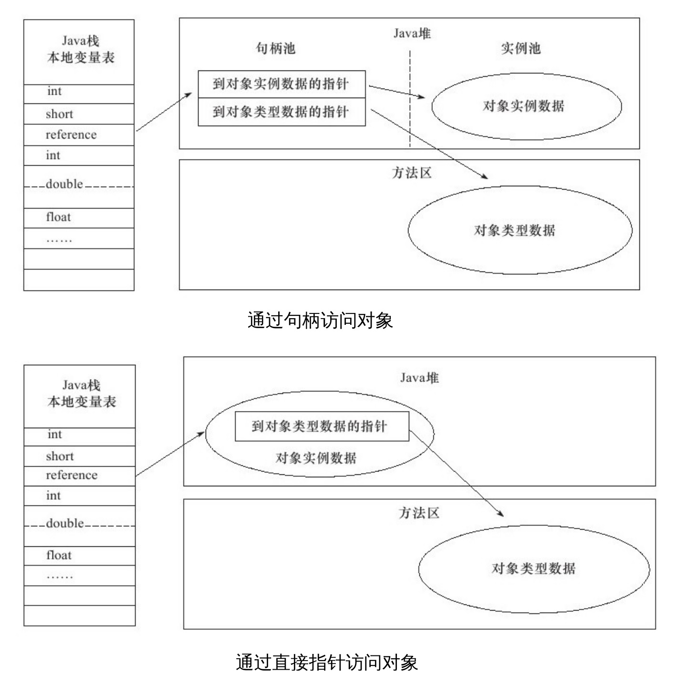

#### 《深入理解JVM虚拟机》

- 前言 

    JVM虚拟机在千差万别的物理机上建立了统一的运行平台，开发人员只需了解Java API、Java语法以及第三方框架
    即可，因此虚拟机的运作并不是一般开发人员必须掌握的知识。
    
- 第一章 走进Java

    广义上，Clojure、JRuby、Groovy等运行于虚拟机上的语言也属于Java技术体系的一员。
    HotSpot VM是SunJDK和OpenJDK中所带的虚拟机，也是目前使用范围最广的虚拟机
    
- 第二章 Java内存区域与内存溢出异常

    C、C++的开发人员，在内存管理领域，对每一个对象拥有所有权，负责每个对象的生命开始
    到终结的维护责任。对于Java开发人员，由于虚拟机的自动内存管理机制，不再需要为每一个对象写
    delete/free代码，不容易出现内存泄漏和内存溢出问题。但由于把内存控制权让渡给了虚拟机，一旦出现
    内存溢出问题将很难排查错误。
    
    Java虚拟机在执行程序过程中，会把所管理的内存分为如下的不同数据区域。
    
    - 程序计数器
    
    程序计数器（Program Counter Register）是一块较小的内存空间，可以看作是当前线程所执行的字节码的行号指示器。
    每个线程都会有一个独立的程序计数器，因此这是以一个“线程私有”的内存，如果线程正在执行一个Java方法，这个计数器
    记录的是正在执行的虚拟机字节码指令的地址；如果正在执行naive方法，这个计数器则为空（Undefined）。此内存区域
    是唯一一个在Java虚拟机规范中没有规定任何OutOfMemoryError情况的区域。
    
    - 虚拟机栈
    
    Java虚拟机栈（Java Virtual Machine Stacks）也是“线程私有”的，它的生命周期与线程相同。虚拟机栈描述的是Java方法
    执行的内存模型，每个方法在执行的同时都会创建一个栈帧（Stack Frame）用于存储局部变量表、操作数栈、动态链接、方法出口等信息。
    每一个方法从调用直至执行完成，就对应着一个栈帧在虚拟机中从入栈到出栈的过程。
    
    Java虚拟机规范中对这个区域规定了两种异常状态，如果线程请求的栈深度大于虚拟机所允许的深度将抛出StackOverflowError；如果虚拟机栈
    可以动态扩展，但扩展时无法申请到足够的内存就会抛出OutOfMemoryError异常。
    
    - 本地方法栈
    
    本地方法栈（Native Method Stack）与虚拟机所发挥的作用是非常相似的，它们之间的区别不过是虚拟机栈为虚拟机执行Java方法服务，
    而本地方法栈为虚拟机执行本地方法服务。HotSpot甚至直接将本地方法栈和虚拟机栈合二为一。其也会抛出StackOverflowError和
    OutOfMemoryError。
    
    - Java堆
    
    Java堆（Java Heap）是Java虚拟机所管理的内存中最大的一块，Java堆是被所有线程共享的一块内存区域，在虚拟机启动时创建。此
    内存的唯一目的就是存放对象的实例，几乎所有对象的实例都在这里分配内存。Java虚拟机规范中的描述是：所有对象的实例以及
    数组都要在堆上分配，但随着JIT编译器的发展与逃逸分析技术逐渐成熟，该规范也渐渐变得不那么绝对。
    
    Java堆也是垃圾收集器管理的主要区域，因此很多时候也被称作“GC堆”（Garbage Collected Heap）。
    
    - 方法区
    
    方法区（Method Area）与Java堆一样，是各个线程共享的内存区域，它用于存储已被虚拟机加载的类信息、常量、静态变量
    、即时编译器编译后的代码等数据。它有一个别名叫Non-Heap（非堆），目的是与Java堆区分开来。根据虚拟机规范的规定，当方法区
    无法满足内存分配需求时，将抛出OutOfMemoryError异常。
    
    - 运行时常量池
    
    运行时常量池（Runtime Constant Pool）是方法区的一部分。Class文件中除了有类的版本、字段、方法、接口等描述信息外，还有
    一项信息是常量池（Constant Pool Table），用于存放预编译期生成的各种字面量和符号引用，这部分内容将在类加载后进入方法区的
    运行时常量池中存放。受方法区限制，当无法满足内存分配需求时，将抛出OutOfMemoryError异常。
    
    - 直接内存
    
    直接内存（Direct Memory）并不是虚拟机运行时数据区的一部分，也不是Java虚拟机规范中定义的内存区域。但这部分内存也被频繁的使用，也可能导致
    OutOfMemoryError出现。
    
    JDK1.4中引入了NIO类，一种基于通道与缓冲区的IO方式，它可以使用native函数库直接分配堆外内存，然后通过存储在Java堆中的
    DirectByteBuffer对象最为这块内存的引用进行操作。这样在一些场景中显著提高了性能，因为避免了在Java堆和Native堆中来回复制数据。
    
    接下来会讨论HotSpot虚拟机在Java堆中对象分配、布局和访问的全过程。

    - 对象的创建
    
    在语言层面，创建对象通常仅仅是一个new关键词，而在虚拟机中，当遇到一条new指令时，首先将去检查这个指令的参数
    是否能在常量池中定位到一个类的符号引用，并检查这个符号引用代表的类是否已被加载、解析和初始化过。如果没有会有一个类
    加载过程。
    
    类加载检查通过后，接下来虚拟机将为新生对象分配内存。对象所需的内存在类加载完成后便可以完全确定，为对象分配空间的任务
    等同于把一块确定大小的内存从Java堆中划分出来。如果堆内存中区域划分是规整的，只须把指针向空闲空间挪动一段与对象大小相等
    的距离，这种分配称为“指针碰撞”（Bump the Pointer）。
    
    如果Java堆内存并不规整，已使用和未使用的空闲内存相互交错，则虚拟机必须维护一个列表，记录那些内存块是空用的，然后从
    列表中找出足够大的一块空间分配给对象实例，并更新列表记录，这种分配方式称为“空闲列表”（Free List）。
    
    在划分可用空间时可能存在线程安全问题，解决方案有两种，虚拟机采用的是CAS加失败重试的方式。第二种是在堆内存中预先为
    每个线程分配一小块内存，称为本地线程分配缓冲（Thread Local Allocation Buffer，TLAB）。可以通过`-XX:+/-UseTLAB`参数来设定/
    
    接下来虚拟机会对对象进行必要的设置，例如这个对象是哪个类的实例、类的元数据信息、对象的哈希码、对象的GC分代年龄等信息。
    这些信息将存放在对象的对象头（Object Header）之中。此时从虚拟机的角度，一个对象已经产生了。
    
    在HotSpot虚拟机中，对象在内存中存储的布局可以分为3块：对象头（Header）、实例数据（Instance Data）和对齐填充（Padding）。
    
    建立对象是为了使用对象，我们需要通过栈上的reference数据来操作堆上的具体对象。而访问对象的方式有两种。句柄和直接
    指针。如果使用句柄访问，那么会在Java堆中划分一块内存作为句柄池，reference中存储的就是对象的句柄地址，而句柄包含了
    对象实例数据与类型数据各自的具体地址信息。如果是直接指针访问，那么Java堆对象布局中就必须考虑如何防止访问类型数据的相关信息。
        
    HotSpot使用的是直接指针，因为它节省了一次指针定位的时间开销，但在整个软件开发的范围来看，这种通过句柄访问的方式也是十分常见。
    
    - 实战
    
    Java堆内存溢出[HeapOOM.java](demo/src/HeapOOM.java),该程序会造成堆内存溢出并生成一个堆内存快照，此时就要分析是内存
    泄露还是内存溢出，如果是泄露对象是如何导致垃圾收集器无法自动回收它们。如果是内存溢出，则要检查
    虚拟机堆参数（-Xmx与-Xms）。
    
       