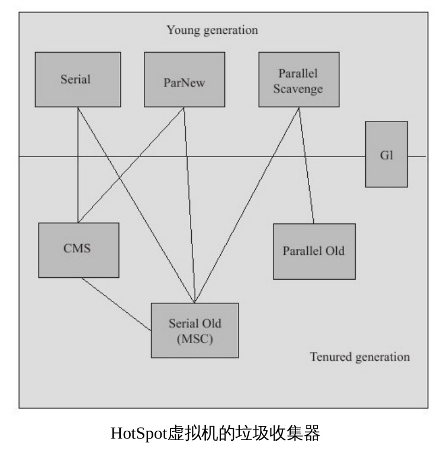
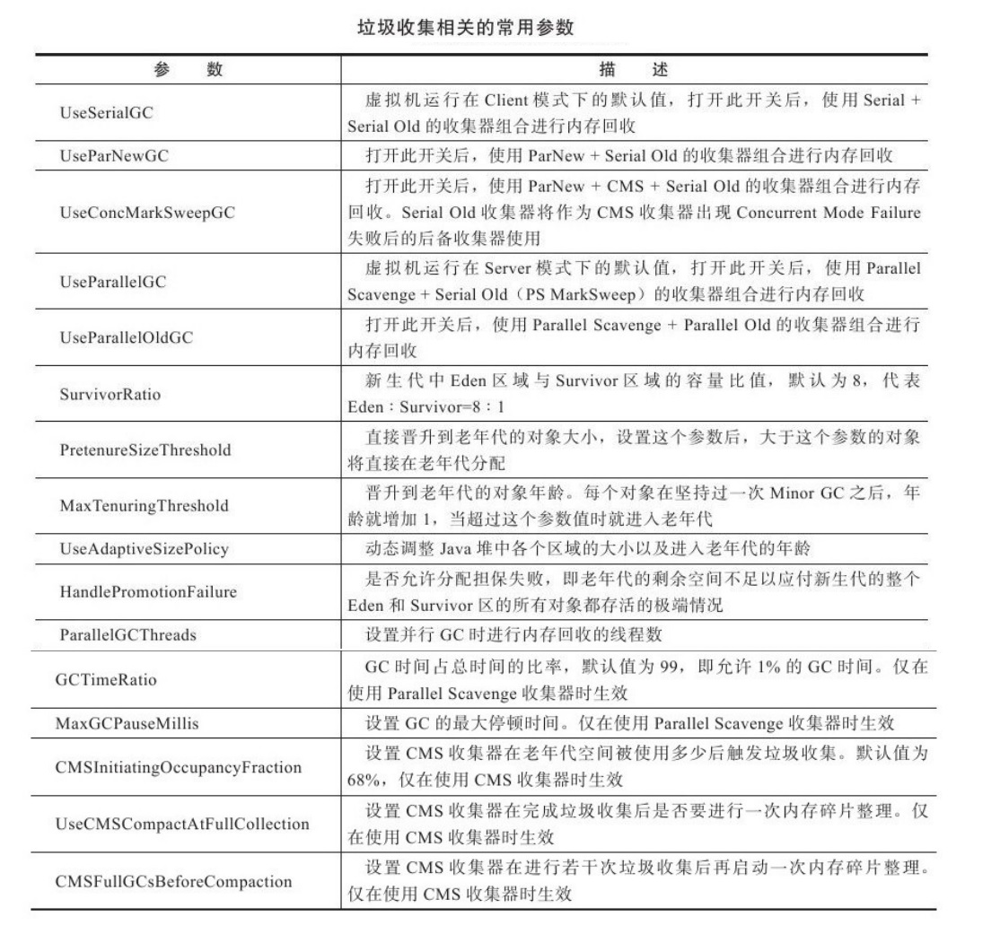

#### 《深入理解JVM虚拟机》

- 前言 

    JVM虚拟机在千差万别的物理机上建立了统一的运行平台，开发人员只需了解Java API、Java语法以及第三方框架
    即可，因此虚拟机的运作并不是一般开发人员必须掌握的知识。
    
- 第一章 走进Java

    广义上，Clojure、JRuby、Groovy等运行于虚拟机上的语言也属于Java技术体系的一员。
    HotSpot VM是SunJDK和OpenJDK中所带的虚拟机，也是目前使用范围最广的虚拟机
    
- 第二章 Java内存区域与内存溢出异常

    C、C++的开发人员，在内存管理领域，对每一个对象拥有所有权，负责每个对象的生命开始
    到终结的维护责任。对于Java开发人员，由于虚拟机的自动内存管理机制，不再需要为每一个对象写
    delete/free代码，不容易出现内存泄漏和内存溢出问题。但由于把内存控制权让渡给了虚拟机，一旦出现
    内存溢出问题将很难排查错误。
    
    Java虚拟机在执行程序过程中，会把所管理的内存分为如下的不同数据区域。
    
    - 程序计数器
    
    程序计数器（Program Counter Register）是一块较小的内存空间，可以看作是当前线程所执行的字节码的行号指示器。
    每个线程都会有一个独立的程序计数器，因此这是以一个“线程私有”的内存，如果线程正在执行一个Java方法，这个计数器
    记录的是正在执行的虚拟机字节码指令的地址；如果正在执行naive方法，这个计数器则为空（Undefined）。此内存区域
    是唯一一个在Java虚拟机规范中没有规定任何OutOfMemoryError情况的区域。
    
    - 虚拟机栈
    
    Java虚拟机栈（Java Virtual Machine Stacks）也是“线程私有”的，它的生命周期与线程相同。虚拟机栈描述的是Java方法
    执行的内存模型，每个方法在执行的同时都会创建一个栈帧（Stack Frame）用于存储局部变量表、操作数栈、动态链接、方法出口等信息。
    每一个方法从调用直至执行完成，就对应着一个栈帧在虚拟机中从入栈到出栈的过程。
    
    Java虚拟机规范中对这个区域规定了两种异常状态，如果线程请求的栈深度大于虚拟机所允许的深度将抛出StackOverflowError；如果虚拟机栈
    可以动态扩展，但扩展时无法申请到足够的内存就会抛出OutOfMemoryError异常。
    
    - 本地方法栈
    
    本地方法栈（Native Method Stack）与虚拟机所发挥的作用是非常相似的，它们之间的区别不过是虚拟机栈为虚拟机执行Java方法服务，
    而本地方法栈为虚拟机执行本地方法服务。HotSpot甚至直接将本地方法栈和虚拟机栈合二为一。其也会抛出StackOverflowError和
    OutOfMemoryError。
    
    - Java堆
    
    Java堆（Java Heap）是Java虚拟机所管理的内存中最大的一块，Java堆是被所有线程共享的一块内存区域，在虚拟机启动时创建。此
    内存的唯一目的就是存放对象的实例，几乎所有对象的实例都在这里分配内存。Java虚拟机规范中的描述是：所有对象的实例以及
    数组都要在堆上分配，但随着JIT编译器的发展与逃逸分析技术逐渐成熟，该规范也渐渐变得不那么绝对。
    
    Java堆也是垃圾收集器管理的主要区域，因此很多时候也被称作“GC堆”（Garbage Collected Heap）。
    
    - 方法区
    
    方法区（Method Area）与Java堆一样，是各个线程共享的内存区域，它用于存储已被虚拟机加载的类信息、常量、静态变量
    、即时编译器编译后的代码等数据。它有一个别名叫Non-Heap（非堆），目的是与Java堆区分开来。根据虚拟机规范的规定，当方法区
    无法满足内存分配需求时，将抛出OutOfMemoryError异常。
    
    - 运行时常量池
    
    运行时常量池（Runtime Constant Pool）是方法区的一部分。Class文件中除了有类的版本、字段、方法、接口等描述信息外，还有
    一项信息是常量池（Constant Pool Table），用于存放预编译期生成的各种字面量和符号引用，这部分内容将在类加载后进入方法区的
    运行时常量池中存放。受方法区限制，当无法满足内存分配需求时，将抛出OutOfMemoryError异常。
    
    - 直接内存
    
    直接内存（Direct Memory）并不是虚拟机运行时数据区的一部分，也不是Java虚拟机规范中定义的内存区域。但这部分内存也被频繁的使用，也可能导致
    OutOfMemoryError出现。
    
    JDK1.4中引入了NIO类，一种基于通道与缓冲区的IO方式，它可以使用native函数库直接分配堆外内存，然后通过存储在Java堆中的
    DirectByteBuffer对象最为这块内存的引用进行操作。这样在一些场景中显著提高了性能，因为避免了在Java堆和Native堆中来回复制数据。
    
    接下来会讨论HotSpot虚拟机在Java堆中对象分配、布局和访问的全过程。

    - 对象的创建
    
    在语言层面，创建对象通常仅仅是一个new关键词，而在虚拟机中，当遇到一条new指令时，首先将去检查这个指令的参数
    是否能在常量池中定位到一个类的符号引用，并检查这个符号引用代表的类是否已被加载、解析和初始化过。如果没有会有一个类
    加载过程。
    
    类加载检查通过后，接下来虚拟机将为新生对象分配内存。对象所需的内存在类加载完成后便可以完全确定，为对象分配空间的任务
    等同于把一块确定大小的内存从Java堆中划分出来。如果堆内存中区域划分是规整的，只须把指针向空闲空间挪动一段与对象大小相等
    的距离，这种分配称为“指针碰撞”（Bump the Pointer）。
    
    如果Java堆内存并不规整，已使用和未使用的空闲内存相互交错，则虚拟机必须维护一个列表，记录那些内存块是空用的，然后从
    列表中找出足够大的一块空间分配给对象实例，并更新列表记录，这种分配方式称为“空闲列表”（Free List）。
    
    在划分可用空间时可能存在线程安全问题，解决方案有两种，虚拟机采用的是CAS加失败重试的方式。第二种是在堆内存中预先为
    每个线程分配一小块内存，称为本地线程分配缓冲（Thread Local Allocation Buffer，TLAB）。可以通过`-XX:+/-UseTLAB`参数来设定/
    
    接下来虚拟机会对对象进行必要的设置，例如这个对象是哪个类的实例、类的元数据信息、对象的哈希码、对象的GC分代年龄等信息。
    这些信息将存放在对象的对象头（Object Header）之中。此时从虚拟机的角度，一个对象已经产生了。
    
    在HotSpot虚拟机中，对象在内存中存储的布局可以分为3块：对象头（Header）、实例数据（Instance Data）和对齐填充（Padding）。
    
    建立对象是为了使用对象，我们需要通过栈上的reference数据来操作堆上的具体对象。而访问对象的方式有两种。句柄和直接
    指针。如果使用句柄访问，那么会在Java堆中划分一块内存作为句柄池，reference中存储的就是对象的句柄地址，而句柄包含了
    对象实例数据与类型数据各自的具体地址信息。如果是直接指针访问，那么Java堆对象布局中就必须考虑如何防止访问类型数据的相关信息。
        
    HotSpot使用的是直接指针，因为它节省了一次指针定位的时间开销，但在整个软件开发的范围来看，这种通过句柄访问的方式也是十分常见。
    
    - 实战
    
    Java堆内存溢出[HeapOOM.java](demo/src/HeapOOM.java),该程序会造成堆内存溢出并生成一个堆内存快照，此时就要分析是内存
    泄露还是内存溢出，如果是泄露对象是如何导致垃圾收集器无法自动回收它们。如果是内存溢出，则要检查
    虚拟机堆参数（-Xmx与-Xms）。
    
    [JavaVMStackSOF.java](demo/src/JavaVMStackSOF.java)，使用-Xss参数减少栈内存容量，最终会抛出StackOverflowError异常
    
    [RuntimeConstantPoolOOM.java](demo/src/RuntimeConstantPoolOOM.java),这段代码在JDK1.6及之前的版本中，由于
    常量池分配在永久代内，因此会抛出OutOfMomoryError:PermGen space。而在JDK1.7运行上就会一直进行下去。
    
    `-XX:MaxDirectMemorySize`直接内存默认与Java堆的最大值一样
    
- 第三章 垃圾收集器与内存分配策略

    垃圾收集（Garbage Collection，GC）的历史远比Java久远，1960年诞生的Lisp是第一门真正使用内存动态分配和垃圾收集
    技术的语言。当Lisp还在胚胎期时，人们就在思考GC需要完成的3件事情：
    
    哪些内存需要回收？什么时候回收？如何回收？
    
    经过半个世纪的发展，目前内存的动态分配与内存回收技术已经相当成熟。当垃圾收集称为系统达到更高并发量的瓶颈的
    时候，我们就需要对这些自动化的技术实施必要的监控和调节。程序计数器、虚拟机栈、本地方法栈三个区域是
    随线程而生，随线程而灭，这几个区域的内存分配和回收具备确定性，因此不需要过多考虑回收的问题。
    
    而Java堆和方法区则不一样，一个接口的不同实现类、一个方法的多个分支需要的内存都不相同，我们只有在程序处于运行中
    才能知道需要创建哪些对象，这部分内存的分配和回收都是动态的，垃圾收集器关注的是这部分内存，后续讨论的内存也仅指
    这一部分内存。
    
    Java堆中存放着几乎所有的对象实例，哪些对象还存活着，哪些已经死去？
    - 引用计数算法
    
    给对象添加一个引用计数器，当有引用指向它时则加1，当引用失效时减去1，当计数器为0时，则这个对象就是不可能再被
    使用的了。该算法实现简单，判断效率高，但存在一个问题，当两个对象互相引用，则引用计数器不会为0，则无法通知GC回收它们。
    [ReferenceCountingGC.java](demo/src/ReferenceCountingGC.java)
    
    - 可达性分析算法
    
    Java、C#都是通过可达性分析来判断对象是否是存活的，这个算法的基本思路就是通过一系列的称为“GC Roots”的对象作为
    起始点，从这些节点开始向下搜索，搜索走过的路径称为引用链（Reference Chain），当一个对象到GC Roots没有任何引用链
    相连（用图论的话说，就是从GC Roots到这个对象不可达）时，则此对象是不可用的。
    
    在Java中，作为GC Roots的对象包括下面几种：虚拟机栈中引用的对象、方法区中类静态属性引用的对象、方法区中常量引用的对象，本地方法栈中
    native方法引用的对象。
    
    无论是哪种算法，判断对象是否存活都与“引用”有关，JDK1.2之前，内存只有引用和没有被引用两种状态，JDK1.2之后，Java
    对引用的概念进行了扩展，将引用分为强引用（Strong Refernce）、软引用（Soft Reference）、弱引用（Weak Reference）和
    虚引用（Phantom Reference），引用的强度依次逐渐衰减。
    
    强引用类似`Object obj = new Object()`这类，只要强引用存在，对象永远不会被回收。
    软引用是用来描述一些还有用但非必须的对象。在JDK1.2之后，提供了SoftReference类来实现弱引用。
    弱引用是用来描述一些还有用但非必须的对象。在JDK1.2之后，提供了WeakReference类来实现弱引用。
    虚引用是最弱的一种引用关系。在JDK1.2之后，提供了PhantomReference类来实现弱引用。
    
    - 垃圾收集算法
    
    因为各个虚拟机具体实现不同，此处只是介绍几种算法的思想。
    
    1. 标记-清除算法（Mark-Sweep）
    
        分为标记和清除两个阶段，首先标记所有需要回收的对象，在标记完成后统一回收所有被标记的对象。后续的
        所有算法都是基于这种思路进行改进得到的。他的主要不足有两个：一是效率问题，另一个是空间问题，清除
        过后会产生大量不连续的内存碎片。
    
    2. 复制算法
    
        为了解决效率问题，一种称为“复制”的算法出现了，它将可用内存按容量分为大小相等两块，每次使用其中一块，
        当这一块内存用完就将还活着的对象复制到另一块上面，然后再把已使用过的内容一次清理掉。这样使得每次都是对整个
        半区的内存进行内存回收，这种算法的代价是可用内存缩小为了原来的一半，代价未免太高了。
        
    3. 标记-整理算法
    
        标记过程仍然与“标记-清除”算法一样，但后续步骤不是直接对可回收对象进行清理，而是让所有存活的
        对象都向一端移动，然后直接清理掉端边界以外的内存。
        
    4. 分代收集算法
    
        当前商业虚拟机的垃圾收集都采用“分代收集”（Generation Collection）算法。这种算法把对象存活
        周期的不同将内存划分为几块。一般是把Java堆分为新生代和老年代，这样可以根据各个年代的特点采用
        最适当的收集算法。在新生代中，每次垃圾收集都会有大批对象死去，只有少量存活，这是就选用复制算法，只需
        付出少量存活对象的成本就可以完成收集。老年代中因为对象存活率高，就可以使用标记清理或标记整理算法。

    
    接下来会重点介绍CMS和G1两种相对复杂的收集器。
    
    - Serial收集器，历史最悠久，运行时会挂起其他所有工作线程。
    - ParNew收集器：Serial收集器的多线程版本。
    - Parallel Scavenge收集器，新生代的收集器，使用复制算法，并行的多线程收集器。该收集器可以精确
    控制吞吐量
    - Serial Old收集器，负责收集老年代的Serial版本
    - Parallel Old收集器，负责收集老年代的Parallel Scavenge版本。
    - CMS收集器（Concurrent Mark Sweep）是一种以获取最短回收停顿为目标的收集器。目前很大
    一部分的Java应用集中在B/S服务端上，这类应用重视服务的响应速度，希望停顿时间最短，该收集器
    非常符合这个需求。CMS是基于标记清除方法，他的过程包括 1.初始标记，2.并发标记，3.重新标记，4.并发清除
    
    1，2仍需Stop The World，而最耗时的并发标记和并发清除过程可以与用户线程一起工作。
    - G1收集器，当今收集器技术发展的最前沿成果之一，其运作大致可分为 1.初始标记 2.并发标记 3最终标记， 4. 筛选回收
    
    
    
    - 内存分配与回收策略
    
    对象的内存分配，往大方向上说，就是堆上分配，对象主要分配在新生代的Eden上，如果启动了本地线程
    分配缓冲，将按线程优先在TLAB上分配，少数情况下会直接分配到老年代中。
    - 对象有现在Eden中分配
    - 大对象直接进入老年代
    - 长期存活的对象将进入老年代，在新生代中美熬过一次MinorGC，年龄就增长一岁，默认15岁就会被分入
    老年代中，可以通过MaxTenuringThreshold来设定
    - 动态对象年龄判定
    
- 第四章 虚拟机性能监控与故障处理工具

    前两章对于虚拟机内存分配与回收技术的各方面进行了介绍，接下来将把这些知识应用到实际中。
    
    - JDK命令行工具
    
    在java的bin目录中有`java.exe`和`javac.exe`这两个命令行工具，而其他工具则并非所有人都了解，这些
    工具的大小基本稳定在27K左右，这些工具大多都是对jdk/lib/tools.jar类库的一层包装而已。
    
    - jps：虚拟机进程状况工具，列出正在运行的虚拟机进程，并显示虚拟机执行主类名称以及这些进程
    的本地虚拟机唯一ID（Local Virtual Machine Identifier，LVMID）。虽然功能单一，但是使用频率
    最高的JDK命令行工具。
    
    - jstat：虚拟机统计信息监视工具
    
    - jmap：Java内存映像工具
    
    - jhat：虚拟机堆转储快照分析工具，与jmap搭配使用，来分析jmap生成的堆转储快照，不过一般有更专业的
    工具可以使用
    
    - jstack：java堆栈跟踪工具，用于生成当前时刻的线程快照
    

    
    
    
    
       