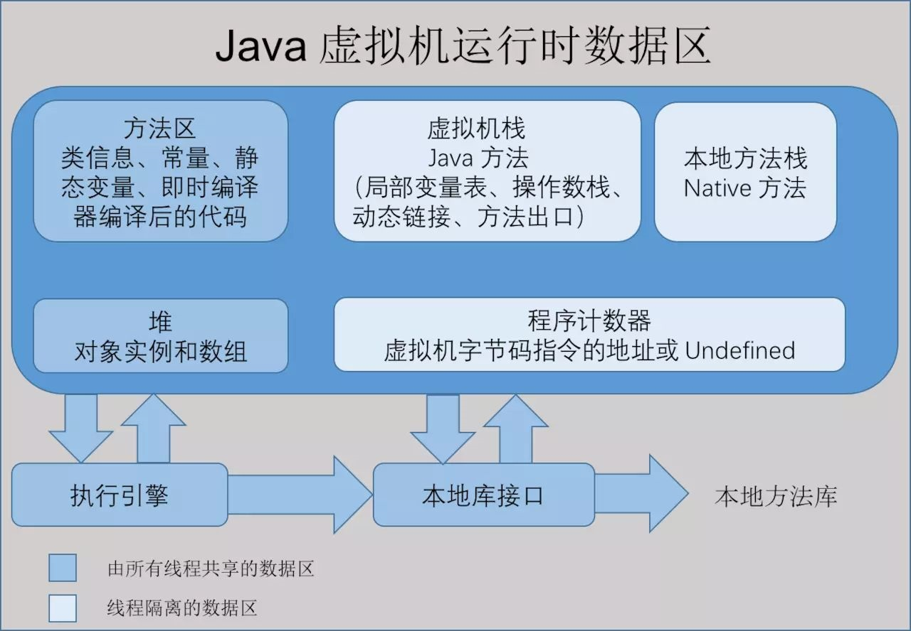

#### 《深入理解JVM虚拟机》

- 前言 

    JVM虚拟机在千差万别的物理机上建立了统一的运行平台，开发人员只需了解Java API、Java语法以及第三方框架
    即可，因此虚拟机的运作并不是一般开发人员必须掌握的知识。
    
- 第一章 走进Java

    广义上，Clojure、JRuby、Groovy等运行于虚拟机上的语言也属于Java技术体系的一员。
    HotSpot VM是SunJDK和OpenJDK中所带的虚拟机，也是目前使用范围最广的虚拟机
    
- 第二章 Java内存区域与内存溢出异常

    C、C++的开发人员，在内存管理领域，对每一个对象拥有所有权，负责每个对象的生命开始
    到终结的维护责任。对于Java开发人员，由于虚拟机的自动内存管理机制，不再需要为每一个对象写
    delete/free代码，不容易出现内存泄漏和内存溢出问题。但由于把内存控制权让渡给了虚拟机，一旦出现
    内存溢出问题将很难排查错误。
    
    Java虚拟机在执行程序过程中，会把所管理的内存分为如下的不同数据区域。
    
    - 程序计数器
    
    程序计数器（Program Counter Register）是一块较小的内存空间，可以看作是当前线程所执行的字节码的行号指示器。
    每个线程都会有一个独立的程序计数器，因此这是以一个“线程私有”的内存，如果线程正在执行一个Java方法，这个计数器
    记录的是正在执行的虚拟机字节码指令的地址；如果正在执行naive方法，这个计数器则为空（Undefined）。此内存区域
    是唯一一个在Java虚拟机规范中没有规定任何OutOfMemoryError情况的区域。
    
    - 虚拟机栈
    
    Java虚拟机栈（Java Virtual Machine Stacks）也是“线程私有”的，它的生命周期与线程相同。虚拟机栈描述的是Java方法
    执行的内存模型，每个方法在执行的同时都会创建一个栈帧（Stack Frame）用于存储局部变量表、操作数栈、动态链接、方法出口等信息。
    每一个方法从调用直至执行完成，就对应着一个栈帧在虚拟机中从入栈到出栈的过程。
    
    Java虚拟机规范中对这个区域规定了两种异常状态，如果线程请求的栈深度大于虚拟机所允许的深度将抛出StackOverflowError；如果虚拟机栈
    可以动态扩展，但扩展时无法申请到足够的内存就会抛出OutOfMemoryError异常。
    
    - 本地方法栈
    
    本地方法栈（Native Method Stack）与虚拟机所发挥的作用是非常相似的，它们之间的区别不过是虚拟机栈为虚拟机执行Java方法服务，
    而本地方法栈为虚拟机执行本地方法服务。HotSpot甚至直接将本地方法栈和虚拟机栈合二为一。其也会抛出StackOverflowError和
    OutOfMemoryError。
    