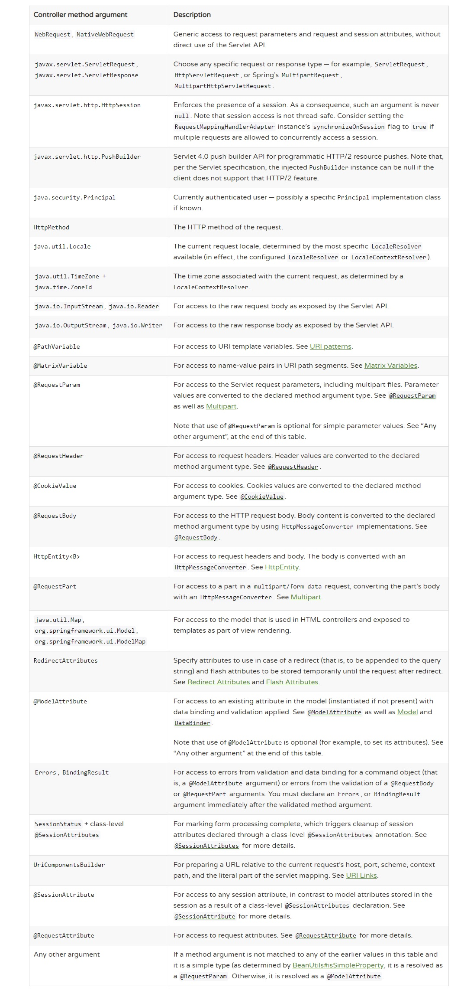
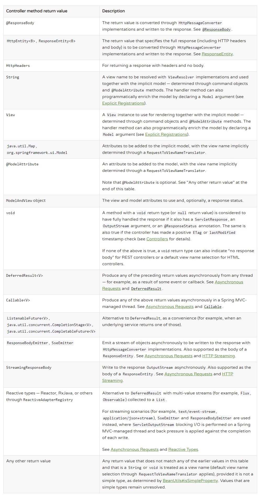

1. IoC 容器

    `org.springframework.beans`和`org.springframework.context`是Spring IoC容器的基础。
    BeanFactory接口提供了基于配置的管理任意Object的能力，ApplicationContext是BeanFactory的
    一个子接口，它能更好的与Spring AOP整合。总的来说BeanFactory提供了基于配置的框架而ApplicationContext
    更面向企业。
    
    Spring中这些组成你业务骨架的实体类被称为bean，`org.springframework.context.ApplicationContext`接口
    代表了IoC容器来初始化、装配和管理bean。这些配置信息的元数据可以是XML、Java注解或是Java代码。它有诸如
    `ClassPathXmlApplicationContext`和` FileSystemXmlApplicationContext`这样的实现类，XML是传统的定义方式，
    你也可以写少量的XML配置来让Spring通过Java注解和Java代码来装配bean。 Spring2.5开始支持注解，Spring3.0
    开始支持Java代码。
    ```
    ApplicationContext context = new ClassPathXmlApplicationContext("services.xml", "daos.xml");
    
    <?xml version="1.0" encoding="UTF-8"?>
    <beans xmlns="http://www.springframework.org/schema/beans"
        xmlns:xsi="http://www.w3.org/2001/XMLSchema-instance"
        xsi:schemaLocation="http://www.springframework.org/schema/beans
            https://www.springframework.org/schema/beans/spring-beans.xsd">
            
        <bean id="..." class="...">   
            <!-- collaborators and configuration for this bean go here -->
        </bean>
        
        <bean id="..." class="...">
            <!-- collaborators and configuration for this bean go here -->
        </bean>
        <!-- more bean definitions go here -->
    </beans>
    ```
    
    容器根据配置信息来组织bean,而bean的定义在容器内由BeanDefinition这个类来代表，这个类中包含了如下的
    属性：
    ```
    Class                       Instantiating Beans
    Name                        Naming Beans
    Scope                       Bean Scopes
    Constructor arguments       Dependency Injection
    Properties Dependency       Injection
    Autowiring mode             Autowiring Collaborators
    Lazy initialization mode    Lazy-initialized Beans
    Initialization method       Initialization Callbacks
    Destruction method          Destruction Callbacks
    ```
    对于不是由容器实例化（开发者手动实例化）的Object，如果需要交由容器管理，可以通过ApplicationContext的getBeanFactory()方法
    获得`DefaultListableBeanFactory`，然后通过`registerSingleton(..)`方法实现。但是一个典型的应用还是应该交由容器来实现类的实例。
    
    一个bean在其所在的容器内必须有一个唯一标识符，在XML配置中，你可以用id或者name属性，或者两者借用来指定唯一的
    一个bean，如果你不提供容器会为你生成一个唯一的标识。大部分情况不提供name的原因是inner bean
    ```
    <bean id="outer" class="...">
        <!-- instead of using a reference to a target bean, simply define the target bean inline -->
        <property name="target">
            <bean class="com.example.Person"> <!-- this is the inner bean -->
                <property name="name" value="Fiona Apple"/>
                <property name="age" value="25"/>
            </bean>
        </property>
    </bean>
    ```
    Spring支持别名
    ```
        <bean id="helloService" class="com.zjc.services.HelloService" >
        </bean>
        <alias name="helloService" alias="firstService"/>
        <alias name="helloService" alias="demoService"/>
    ```
    
    Bean的实例化默认是通过构造器，你也可通过静态的工厂方法
    ```
    <bean id="clientService"  class="examples.ClientService" factory-method="createInstance"/>
    
    public class ClientService {
        private static ClientService clientService = new ClientService();
        private ClientService() {}
        public static ClientService createInstance() {
            return clientService;
        }
    }
    ```
   你也可以通过静态工厂方法来实现
   ```
    <!-- the factory bean, which contains a method called createInstance() -->
    <bean id="serviceLocator" class="examples.DefaultServiceLocator">
        <!-- inject any dependencies required by this locator bean -->
    </bean>
    
    <!-- the bean to be created via the factory bean -->
    <bean id="clientService"
        factory-bean="serviceLocator"
        factory-method="createClientServiceInstance"/>
        
    <bean id="accountService"
        factory-bean="serviceLocator"
        factory-method="createAccountServiceInstance"/>
        
    public class DefaultServiceLocator {
        private static ClientService clientService = new ClientServiceImpl();
        
        public ClientService createClientServiceInstance() {
            return clientService;
        }
        public AccountService createAccountServiceInstance() {
            return accountService;
        }
    }
   ``` 
   依赖注入有两种形式，通过构造器或是setter方法，Spring团队推荐构造器注入。
   
   默认的容器会在启动时初始化所有单例的bean，当你手动指定lazy-init属性为true时，则这个初始化
  过程会被延迟到这个bean第一次被需要时。但是当你的懒加载bean被别的单例bean所依赖时，他就回立即初始化。
  你可以从容器层面来实现懒加载
  ```
   <beans default-lazy-init="true">
       <!-- no beans will be pre-instantiated... -->
   </beans>
  ```
  在Spring的诸多应用场景中bean都是单例形式，当一个单例bean需要和一个非单例bean组合使用或者
  一个非单例bean和另一个非单例bean组合使用时，我们通常都是将依赖以属性的方式放到bean中来引用，
  然后以@Autowired来标记需要注入的属性。但是这种方式在bean的生命周期不同时将会出现很明显的问题，
  假设单例bean A需要一个非单例bean B（原型），我们在A中注入bean B，每次调用bean A中的方法时都会
  用到bean B，我们知道Spring Ioc容器只在容器初始化时执行一次，也就是bean A中的依赖bean B只有一次
  注入的机会，但是实际上bean B我们需要的是每次调用方法时都获取一个新的对象（原型）所以问题明显就是：
  我们需要bean B是一个原型bean，而事实上bean B的依赖只注入了一次变成了事实上的单例bean。
  
  解决方法有两种，Bean A继承`ApplicationContextAware`,来获得ApplicationContext，依赖Bean b的时候通过
  getBean的方法手动获取，二是通过@Lookup注解
  ```
  <bean id="myCommand" class="fiona.apple.AsyncCommand" scope="prototype">
      <!-- inject dependencies here as required -->
  </bean>
  
  <!-- commandProcessor uses statefulCommandHelper -->
  <bean id="commandManager" class="fiona.apple.CommandManager">
      <lookup-method name="createCommand" bean="myCommand"/>
  </bean>

    public abstract class CommandManager {
        public Object process(Object commandState) {
            Command command = createCommand();
            command.setState(commandState);
            return command.execute();
        }

        @Lookup("myCommand")
        protected abstract Command createCommand();
    }
  ```
  
  Spring框架提供了六种Bean的Scope类型
  
  
  - Singleton Scope
    一个容器中只有一个bean的实例
  - Prototype Scope
  
    当通过getBean方法或是被别的bean依赖时，都会实例化一个新的bean
    
  - Request、Session、Application和WebSocket Scopes
  
    只在web-aware的ApplicationContext才能生效，在普通的容器中会引发IllegalStateException。
    
    当你在一个长生命周期的Bean中依赖了一个短生命周期的Bean，
    ```
    <bean id="userPreferences" class="com.something.UserPreferences" scope="session">
        <aop:scoped-proxy/>
    </bean>
    
    <bean id="userManager" class="com.something.UserManager">
        <property name="userPreferences" ref="userPreferences"/>
    </bean>
    ```
    通过 `<aop:scoped-proxy/>`元素，userManager操作代理对象，代理对象去session域中获取真正的对象方法调用。
    当你需要实现自己的Scope类型是你可以重写`org.springframework.beans.factory.config.Scope`来实现。
    
    Spring提供了若干接口来帮助你定制Bean的生命周期事件，可以通过`org.springframework.beans.factory.InitializingBean`
    或是`@PostConstruct`（JSR-250）注解来，推荐使用注解方式。
 
   Bean Definitoin中记录了Bean很多的相关配置信息，包括构造器参数、属性、初始化方法、静态工厂方法等，
   如果我们让一个子Bean类继承父Bean，就可以节省不少配置，子类配置由ChildBeanDefinition类代表，当时用
   XML配置时可以这样实现
   ```
    <bean id="inheritedTestBean" abstract="true"
            class="org.springframework.beans.TestBean">
        <property name="name" value="parent"/>
        <property name="age" value="1"/>
    </bean>
    
    <bean id="inheritsWithDifferentClass"
            class="org.springframework.beans.DerivedTestBean"
            parent="inheritedTestBean" init-method="initialize">  
        <property name="name" value="override"/>
        <!-- the age property value of 1 will be inherited from parent -->
    </bean>
   ```
   手动指定parent。
   
   Spring也提供了基于注解的配置，需要在xml中添加`<context:annotaion-config />`，注意它
   只会查找当前当前容器内bean上的注解，诸如`@Autowired`，JSR-330的`@Inject`有相同功能，
   该xml元素实际作用就是显式的向容器中注册AutowiredAnnotationBeanPostProcessor，CommonAnnotationBeanPostProcessor
    ，PersistenceAnnotationBeanPostProcessor，RequiredAnnotationBeanPostProcessor这四个Processor来处理注解
    
  你可以使用`@Autowired`来注入那些著名的接口诸如 BeanFactory, ApplicationContext, Environment, ResourceLoader,
   ApplicationEventPublisher和MessageSource。 因为该接口是基于Type类型来导入，因此一个接口可能存在多个可能的实现，
   这时就需要通过`@Primary`或`@Qualifier`注解来指定具体的实现。 Spring也支持JSR-250的注解`@Resource`来注入。
   
   之前的例子还是需要在XML中手动定义bean，而是把注入的工作交给了注解，接下来我们也将无需再XML中定义
   bean，而是也交给注解来完成，如`@Component`,`@Repository`, `@Service`,和`@Controller`。
   
   在XML中需要添加元素`<context:component-scan base-package="com.zjc"/>`，该注解会隐式的启用
   `<context:annotation-config>`。该元素内可以配置include-filter 和 exclude-filter，支持包括
   注解、切面、正则等多种规则来过滤。实现自己的BeanNameGenerator接口可以定义自己的默认命名bean
   的方式。
   ```
    <beans>
        <context:component-scan base-package="org.example">
            <context:include-filter type="regex" expression=".*Stub.*Repository"/>
            <context:exclude-filter type="annotation" expression="org.springframework.stereotype.Repository"/>
        </context:component-scan>
    </beans>
    
    ----------------------------
    <beans>
        <context:component-scan base-package="org.example"
            name-generator="org.example.MyNameGenerator" />
    </beans>
   ```
   如果需要指定Bean的scope类型可以添加`@Scope`注解，Spring3.0开始支持JSR-330的注解。
   @Autowired和@Inject，@Component和@Name，@Scope和@Singleton等。
   
   基于Java代码的配置，其核心使@Bean和@Configuration注解。当需要Java Config混合XML配置时可以
   ```
    @Configuration
    @ImportResource("classpath:/com/acme/properties-config.xml")
    public class AppConfig {
    }
   ```
   
   `Enviroment`是一个容器类整合了profiles和properties的重要接口。
   ```
    @Configuration
    @PropertySource("classpath:/com/myco/app.properties")
    public class AppConfig {
    
        @Autowired
        Environment env;
    
        @Bean
        public TestBean testBean() {
            TestBean testBean = new TestBean();
            testBean.setName(env.getProperty("testbean.name"));
            return testBean;
        }
    }
   ```
   
   Java有标准的URL类来访问资源但却不够通用，Spring中的Resource接口是对底层的resource的一层封装，
   Spring包含了以下几种实现:UrlResource，ClassPathResource，FileSystemResource，ServletContextResource，
   InputStreamResource，ByteArrayResource。你也可以通过ResourceLoader接口来获得Resource。
   
   Spring提供了`Validator`接口，来提供在各层中对于验证的基础需求。而对于数据绑定提供了`DataBinder`接口，
   两种接口组成了validation包。Spring4.0开始支持JSR-303/JSR-349d的Bean验证。
   ```
    public class PersonForm {
    
        @NotNull
        @Size(max=64)
        private String name;
    
        @Min(0)
        private int age;
    }
   ```
   
   Spring 的AOP提供了一下几种Advice,Before advice,After returning advice,After throwing advice,
   After (finally) advice,Around advice。
   其中，Around Advice是最常用的。但我们仍建议根据功能去是用更合适的advice而不是统统用Around advice，
   以便面一些潜在的风险。
   
   Spring AOP默认是使用Java的动态代理，他能代理任意接口。AOP也可以使用CGLIB代理，他能代理类而不仅仅是
   接口，当一个类没有继承接口时就会使用CGLIB。可以使用`@EnableAspectJAutoProxy`或是`<aop:aspectj-autoproxy/>`来开启
   AspectJ。之后所有在容器内添加了@AspectJ注解的类都会被探测到。[TestAspectApplication](spring-reference/src/test/java/com/zjc/test/TestAspectApplication.java)
   
- Web on Servlet Stack

    Spring Web MVC是一个基于Servlet API的原生的web框架，它有一个更被广泛认知的名字，Spring MVC。与SpringMVC并行，在
    Spring5.0一入了Spring WebFlux。
    
    和其他web框架一样，都需要一个前置的控制器来处理所有请求，`DispatcherServlet`和任意的其他Servlet一样，
    都需要在`web.xml`中声明和映射
   
   注册和初始化DispatherServlet可以通过java配置
   ```
    public class MyWebApplicationInitializer implements WebApplicationInitializer {
    
        @Override
        public void onStartup(ServletContext servletCxt) {
    
            // Load Spring web application configuration
            AnnotationConfigWebApplicationContext ac = new AnnotationConfigWebApplicationContext();
            ac.register(AppConfig.class);
            ac.refresh();
    
            // Create and register the DispatcherServlet
            DispatcherServlet servlet = new DispatcherServlet(ac);
            ServletRegistration.Dynamic registration = servletCxt.addServlet("app", servlet);
            registration.setLoadOnStartup(1);
            registration.addMapping("/app/*");
        }
    }
    ```
    或是XML
    ```
    <web-app>
    
        <listener>
            <listener-class>org.springframework.web.context.ContextLoaderListener</listener-class>
        </listener>
    
        <context-param>
            <param-name>contextConfigLocation</param-name>
            <param-value>/WEB-INF/app-context.xml</param-value>
        </context-param>
    
        <servlet>
            <servlet-name>app</servlet-name>
            <servlet-class>org.springframework.web.servlet.DispatcherServlet</servlet-class>
            <init-param>
                <param-name>contextConfigLocation</param-name>
                <param-value></param-value>
            </init-param>
            <load-on-startup>1</load-on-startup>
        </servlet>
    
        <servlet-mapping>
            <servlet-name>app</servlet-name>
            <url-pattern>/app/*</url-pattern>
        </servlet-mapping>
    
    </web-app>
    ```
    DispatcherServlet启动需要配置一个WebApplicationContext，而WebApplicationContext则关联了ServletContext和Servlet。对
    一些应用来说一个单独的WebApplicationContext就足够了。但也可以有一个context的层次体系，一个root context被
    为多个DispathcerServlet提供基础bean。
    ```
    public class MyWebAppInitializer extends AbstractAnnotationConfigDispatcherServletInitializer {
    
        @Override
        protected Class<?>[] getRootConfigClasses() {
            return new Class<?>[] { RootConfig.class };
        }
    
        @Override
        protected Class<?>[] getServletConfigClasses() {
            return new Class<?>[] { App1Config.class };
        }
    
        @Override
        protected String[] getServletMappings() {
            return new String[] { "/app1/*" };
        }
    }
    ```
    
    ```
    <web-app>
    
        <listener>
            <listener-class>org.springframework.web.context.ContextLoaderListener</listener-class>
        </listener>
    
        <context-param>
            <param-name>contextConfigLocation</param-name>
            <param-value>/WEB-INF/root-context.xml</param-value>
        </context-param>
    
        <servlet>
            <servlet-name>app1</servlet-name>
            <servlet-class>org.springframework.web.servlet.DispatcherServlet</servlet-class>
            <init-param>
                <param-name>contextConfigLocation</param-name>
                <param-value>/WEB-INF/app1-context.xml</param-value>
            </init-param>
            <load-on-startup>1</load-on-startup>
        </servlet>
    
        <servlet-mapping>
            <servlet-name>app1</servlet-name>
            <url-pattern>/app1/*</url-pattern>
        </servlet-mapping>
    
    </web-app>
    ```
    
    DispatcherServlet内部代理了一些功能性的bean来处理请求和渲染结果，包括：
    
    - HandlerMapping： 映射请求，其有两个实现类RequestMappingHandlerMapping （@RequestMapping）和
                        SimpleUrlHandlerMapping 
    - HandlerAdapter： 帮助DispatcherServlet调用请求映射到的处理器
    - HandlerExceptionResolver： 处理异常，将他们映射到处理器或视图或是其他目标
    - ViewResolver： 将String型的视图名解析成真实的视图并渲染到response中
    - LocalResolver，LocaleContextResolver：解析客户端的时区、区域并尝试提供国际化的视图
    - ThemeResolver： 解析你的web应用能使用的主题，来提供个性化的布局
    - MultipartResolver： 解析multi-part类型的请求，例如从浏览器上上传多个文件
    - FlashMapManager： ----
    
    Dispatcher会在WebApplicationContext检索这些bean，如果没有配置则会使用默认的bean
    ```
    # Default implementation classes for DispatcherServlet's strategy interfaces.
    # Used as fallback when no matching beans are found in the DispatcherServlet context.
    # Not meant to be customized by application developers.
    
    org.springframework.web.servlet.LocaleResolver=org.springframework.web.servlet.i18n.AcceptHeaderLocaleResolver
    
    org.springframework.web.servlet.ThemeResolver=org.springframework.web.servlet.theme.FixedThemeResolver
    
    org.springframework.web.servlet.HandlerMapping=org.springframework.web.servlet.handler.BeanNameUrlHandlerMapping,\
    	org.springframework.web.servlet.mvc.method.annotation.RequestMappingHandlerMapping,\
    	org.springframework.web.servlet.function.support.RouterFunctionMapping
    
    org.springframework.web.servlet.HandlerAdapter=org.springframework.web.servlet.mvc.HttpRequestHandlerAdapter,\
    	org.springframework.web.servlet.mvc.SimpleControllerHandlerAdapter,\
    	org.springframework.web.servlet.mvc.method.annotation.RequestMappingHandlerAdapter,\
    	org.springframework.web.servlet.function.support.HandlerFunctionAdapter
    
    
    org.springframework.web.servlet.HandlerExceptionResolver=org.springframework.web.servlet.mvc.method.annotation.ExceptionHandlerExceptionResolver,\
    	org.springframework.web.servlet.mvc.annotation.ResponseStatusExceptionResolver,\
    	org.springframework.web.servlet.mvc.support.DefaultHandlerExceptionResolver
    
    org.springframework.web.servlet.RequestToViewNameTranslator=org.springframework.web.servlet.view.DefaultRequestToViewNameTranslator
    
    org.springframework.web.servlet.ViewResolver=org.springframework.web.servlet.view.InternalResourceViewResolver
    
    org.springframework.web.servlet.FlashMapManager=org.springframework.web.servlet.support.SessionFlashMapManager
    ```
  DispatcherServlet按照如下步骤来处理请求
  
  - WebApplicationContext 会搜索和绑定请求，使其能被进程中其他元素和控制器使用，默认绑定在键
    `DispatcherServlet.WEB_APPLICATION_CONTEXT_ATTRIBUTE `
  - locale resolver会绑定到请求，使处理器能对请求进行本地会解析
  - theme resolver会被绑定到请求来让视图决定使用什么主题
  - 当指定了multipart file resolver，如果请求复合要求则会被包装成一个`MultipartHttpServletRequest`
  - 寻找一个合适的处理器，相关的执行链会处理模型数据
  - 如果模型被返回，视图会被渲染
  
  HandlerExceptionResolver在WebApplicationContext中来解决请求处理过程中的异常。
  
  你可以使用@Controller注解来定义一个控制器，为了能自动探测，需要在XML文件中进行配置，
  ```
  <?xml version="1.0" encoding="UTF-8"?>
  <beans xmlns="http://www.springframework.org/schema/beans"
      xmlns:xsi="http://www.w3.org/2001/XMLSchema-instance"
      xmlns:p="http://www.springframework.org/schema/p"
      xmlns:context="http://www.springframework.org/schema/context"
      xsi:schemaLocation="
          http://www.springframework.org/schema/beans
          https://www.springframework.org/schema/beans/spring-beans.xsd
          http://www.springframework.org/schema/context
          https://www.springframework.org/schema/context/spring-context.xsd">
    <context:component-scan base-package="org.example.web"/>
    </beans>
  ```
  @RestController注解是一个复合注解，组合了@Controller和@ResponseBody。
  @RequestMapping用来将请求映射到控制器，它有多个变种来对应不同URL，@GetMapping，@PostMapping，@PutMapping
  @DeleteMapping，@PatchMapping
  ```
    @GetMapping("/owners/{ownerId}/pets/{petId}")
    public Pet findPet(@PathVariable Long ownerId, @PathVariable Long petId) {
        // ...
    }
    ---------------------------------------------------------------------------------
    @Controller
    @RequestMapping("/owners/{ownerId}")
    public class OwnerController {
    
        @GetMapping("/pets/{petId}")
        public Pet findPet(@PathVariable Long ownerId, @PathVariable Long petId) {
            // ...
        }
    }
    --------------------------------------------------------------------------------
    //假设请求时"/spring-web-3.0.5 .jar"
    @GetMapping("/{name:[a-z-]+}-{version:\\d\\.\\d\\.\\d}{ext:\\.[a-z]+}")
    public void handle(@PathVariable String version, @PathVariable String ext) {
        // ...
    }
    ----------------------------------------------------------------------------------
    @PostMapping(path = "/pets", consumes = "application/json") 
    public void addPet(@RequestBody Pet pet) {
        // ...
    }
    ----------------------------------------------------------------------------------
    @GetMapping(path = "/pets/{petId}", produces = "application/json;charset=UTF-8") 
    @ResponseBody
    public Pet getPet(@PathVariable String petId) {
        // ...
    }
  ```
  consumes 属性用来限定请求的`Content-Type`，produces 用来限定请求的`Accpet`属性。
  ```
    @GetMapping(path = "/pets/{petId}", params = "myParam=myValue") 
    public void findPet(@PathVariable String petId) {
        // ...
    }
    ------------------------------------------------------------------------------------
    @GetMapping(path = "/pets", headers = "myHeader=myValue") 
    public void findPet(@PathVariable String petId) {
        // ...
    }
  ```  
  params属性用来限定请求的参数，headers属性用来限定头部参数
  
  Controller方法中可以注入的参数类型有
  
  
  方法允许的返回参数类型有
  
  
  ```
  Host                    localhost:8080
  Accept                  text/html,application/xhtml+xml,application/xml;q=0.9
  Accept-Language         fr,en-gb;q=0.7,en;q=0.3
  Accept-Encoding         gzip,deflate
  Accept-Charset          ISO-8859-1,utf-8;q=0.7,*;q=0.7
  Keep-Alive              300
  
  @GetMapping("/demo")
  public void handle(
          @RequestHeader("Accept-Encoding") String encoding, 
          @RequestHeader("Keep-Alive") long keepAlive) { 
      //...
  }
  ```
  你可以使用@CookieValue来绑定HTTP的cookie信息，下面的这个例子展示了用法
  ```
    
    JSESSIONID=415A4AC178C59DACE0B2C9CA727CDD84
  
  
    @GetMapping("/demo")
    public void handle(@CookieValue("JSESSIONID") String cookie) { 
        //...
    }
  ```
  
  @ModelAttribute可以绑定在方法参数上，模型的参数会从HTTP的请求参数中进行匹配和转型。
  ```
    @PostMapping("/owners/{ownerId}/pets/{petId}/edit")
    public String processSubmit(@ModelAttribute Pet pet) { }
  ```
  
  ```
    @PostMapping("/files/{path}")
    public String upload(...) {
        // ...
        return "redirect:files/{path}";
    }
  ```
  
  @ResponseBody注解可以把返回值写入到响应体中，通过HttpMessageConverter，通过ResponseEntity可以实现
  相同功能。
  ```
    @GetMapping("/accounts/{id}")
    @ResponseBody
    public Account handle() {
        // ...
    }
    
     @RequestMapping("/pet/{name}/{id}")
        public ResponseEntity<Pet> pet(@ModelAttribute Pet pet) {
            return ResponseEntity.ok(pet);
        }
  ```
   1.3.5
    
    
    
