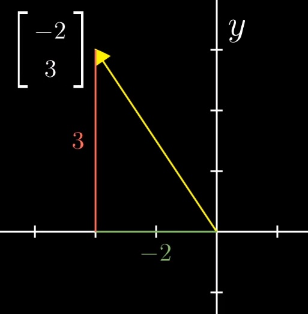
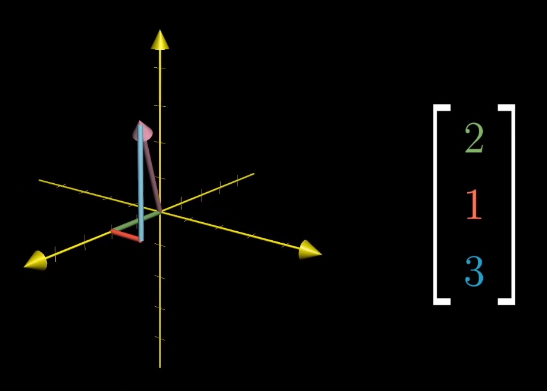
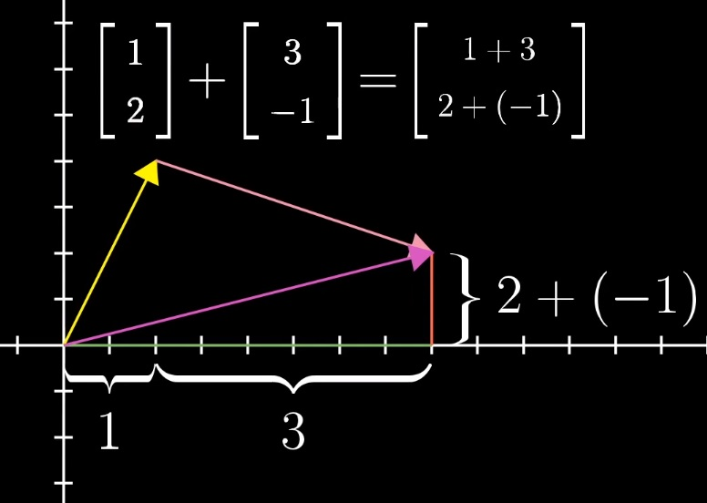
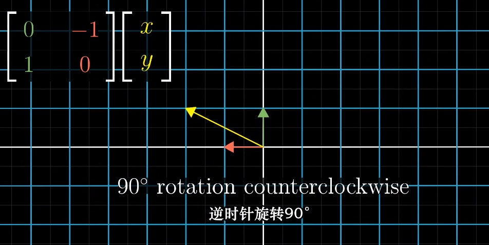

#### B站线代视频学习笔记
[视频地址](https://www.bilibili.com/video/av6731067)

- P1 向量(Vector)
    
    - 物理学：向量是空间中的一个箭头，有长度和方向
    - 计算机：向量是有序的数字列表
    - 数学：向量是任意有大小和方向的量
    
    
    
    从原点出发，第一个数代表要顺着x轴走多远，第二个数代表要顺着y轴走多远
    
    
    
     从原点出发，第一个数代表要顺着x轴走多远，第二个数代表要顺着y轴走多远，第三个数代表沿着z轴的距离
     
     
     
     - 向量加法
     
     
     
     - 向量数乘
     
     数字在线性代数中的主要作用就是缩放向量，也可以称为标量
     
     
     
     
 - P2 线性组合、张成的空间与基
 
    i与j是xy坐标系的基向量，两个基向量全部 线性组合构成的集合空间称为张成的空间
    
- P3 矩阵与线性变换

     变换，函数的另一种说法，接收一个向量，输出另一个向量，
     线性变换：直线在变换后仍然保持直线，不能弯曲。远点必须固定  
     
     - 矩阵相乘
     
     
     
     第一列向量是线性变换后的基向量，同理
     是线性变换后的基向量。
     
     
     
     
     
     当我们把基向量逆时针旋转90°，就得到了一组新的基向量
     
    

     
     

