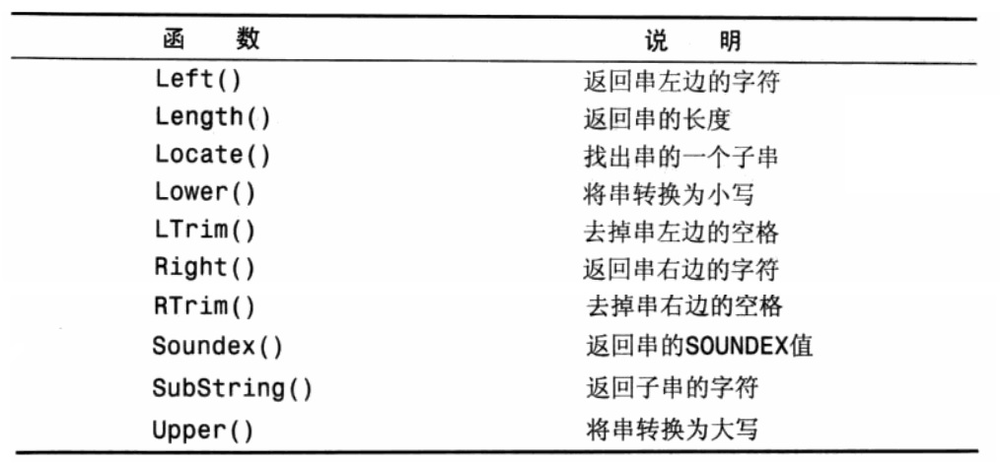
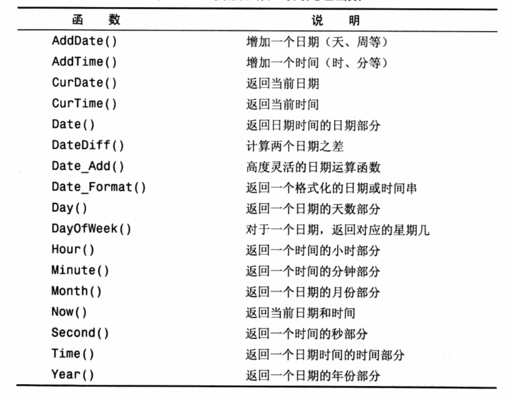
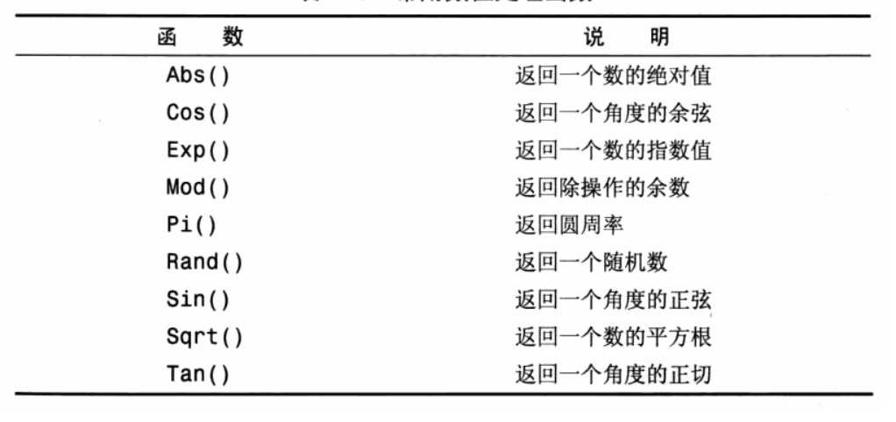
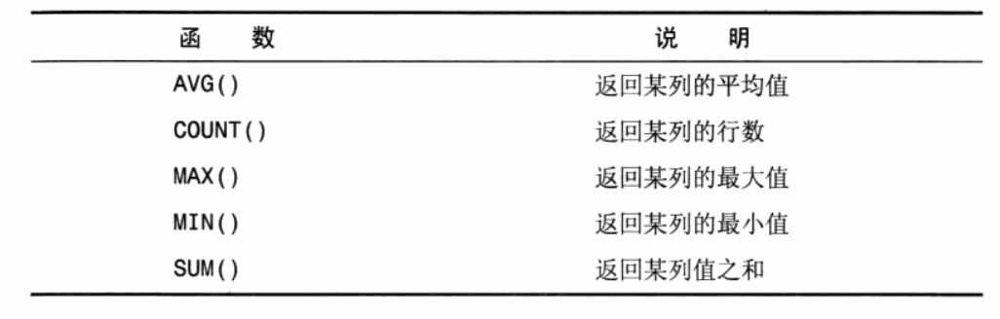
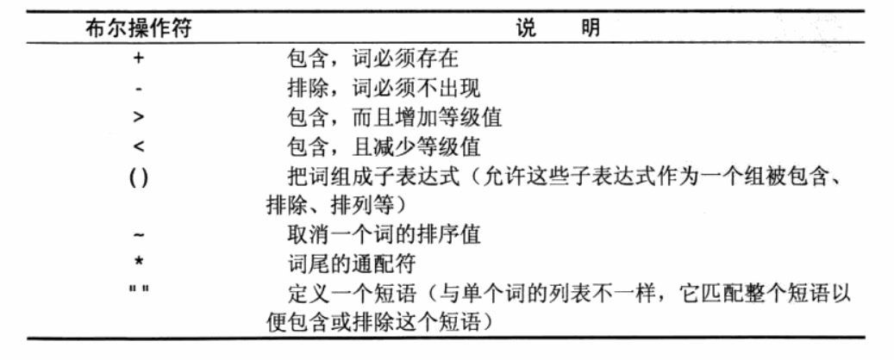

- 第1章 了解SQL

    - 数据库：保存有组织的数据的容器
    - 表|模式（schema）：某种特定数据类型的结构化清单
    - 列：表中的一个字段
    - 行：表中的一条记录
    - 主键（primary key）：能够唯一区分表中每一行的字段
    
- 第2章 MySQL简介

    MySQL是一种数据库管理系统，是一种基于客户机-服务器的数据库。服务器部分
    负责所有数据访问和处理的一个软件。这个软件运行在称为数据库服务器的计算机上。
    与数据库数据相关的添加、删除和数据更新的所有请求都由服务器软件完成。
    
    客户机是与用户打交道的软件。负责与服务器通信。服务器和客户机可能安装在两台计算机
    或同一台计算机上。
    
- 第3章 使用MySQL

   ```
    SHOW DATABASES;
    SHOW TABLES;
    SHOW COLUMNS FROM customers; | DESCRIBE customers;
    SHOW STATUS; --显示广泛的服务器状态信息
    SHOW CREATE TABLE customers; --展示建表语句，同样还可以用于DATABASE、FUNCTIONS、PROCDURE等
    SHOW GRANTS;--显示授予用户的安全权限
    SHOW ERRORS; | SHOW WARNINGS;--用来显示服务器错误或警告信息
   ```
   
- 第4章 检索数据

   ```
    SELECT prod_name FROM products;
    SELECT prod_id,prod_name,prod_price FROM products;
    SELECT * FROM products;
    SELECT DISTINCT vend_id FROM products;
    SELECT prod_name FROM products LIMIT 5;
    SELECT prod_name FROM products LIMIT 5,5;#开始位置，要检索的行数
    SELECT products.prod_name FROM products;
   ``` 
- 第5章 排序检索数据
    ```
    SELECT prod_name FROM products ORDER BY prod_name;
    SELECT prod_id,prod_price,prod_name FROM products ORDER BY prod_price,prod_name;
    SELECT prod_id,prod_price,prod_name FROM products ORDER BY prod_price desc ;
    SELECT prod_price FROM products ORDER BY prod_price desc LIMIT 1; #找出最高价
    ```
    
- 第6章 过滤数据

    ```
    SELECT prod_name,prod_price FROM products WHERE prod_price=2.5;
    SELECT prod_name,prod_price FROM products WHERE prod_price<10;
    SELECT vend_id,prod_name FROM products WHERE vend_id <>1003;
    SELECT prod_name,prod_price FROM products WHERE prod_price BETWEEN 5 AND 10; # BETWEEN可用于数字和日期
    SELECT cust_id FROM customers WHERE cust_email IS NULL;
    ```
    
- 第7章 数据过滤
    ```
    SELECT prod_name,prod_price FROM products WHERE vend_id =1003 AND prod_price<=10;
    SELECT prod_name,prod_price FROM products WHERE vend_id =1003 OR vend_id = 1002;
    SELECT prod_name,prod_price FROM products WHERE vend_id IN (1002,1003);
    SELECT prod_name,prod_price FROM products WHERE vend_id NOT IN (1002,1003);
    ```
    
- 第8章 用通配符过滤

   ```
    SELECT prod_name,prod_price FROM products WHERE prod_name LIKE 'jet%';
    SELECT prod_name,prod_price FROM products WHERE prod_name LIKE 's%e';
    SELECT prod_name,prod_price FROM products WHERE prod_name LIKE '_ ton anvil';
   ```
   
- 第9章 用正则表达式进行搜索

    ```
    SELECT prod_name,prod_price FROM products WHERE prod_name REGEXP '1000';
    SELECT prod_name,prod_price FROM products WHERE prod_name REGEXP '1000|2000';
    SELECT prod_name,prod_price FROM products WHERE prod_name REGEXP '[123] ton';
    ```
    
- 第10章 创建计算字段
    
    数据库表中的数据一般不是应用程序所需要的格式，因此需要对字段进行处理
    - 拼接字段
    
        多数数据库使用`||`来实现拼接，但在MySQL中使用Concat()函数来实现，这一点要铭记于心。
        ```
        SELECT CONCAT(vend_name,'(',vend_country,')') FROM vendors ORDER BY vend_name;
        SELECT CONCAT(RTRIM(vend_name),'(',RTRIM(vend_country),')') FROM vendors ORDER BY vend_name;
        SELECT CONCAT(RTRIM(vend_name),'(',RTRIM(vend_country),')') AS vend_title FROM vendors ORDER BY vend_name;
        ```
    - 执行算数计算： MySQL执行对数字类型字段进行算数计算
    
- 第11章 使用数据处理函数
    
    DBMS支持通过函数处理数据，但是这样移植性会较差。
    
    - 文本处理函数： 
    
    
    其中SOUNDEX是按照发音进行模糊匹配的函数
    
    - 日期处理函数
    
    
    - 数值处理函数
    
    
- 第12章 汇总数据

    - 聚集函数
    
    
- 第13章 分组数据

    `select vend_id ,count(*) as num_prods from products group by vend_id;`
    
    GROUP子句可以包含任意数目的列。这使得可以对分组进行嵌套，提供更细致的控制。如果分组进行了嵌套，数据
    会在最后规定的分组上进行汇总。GROUP BY子句列出的所有列必须是索引列或是有效的表达式（不能是聚集函数）。如果
    在子句中使用的是表达式，则在select中也要用相同的表达式，而不能是别名。
    
    GROUP BY必须出现在WHERE 之后，ORDER BY之前。
    
    如果需要过滤某个分组，则需要使用HAVING关键字。WHERE过滤行，HAVING过滤分组。WHERE会在分组钱进行过滤，HAVING
    则是在数据分组之后过滤。
    `select cust_id,count(*) as orders from orders group by cust_id having orders>=2;`
    
- 第14章 使用子查询

    MySQL4.1引入了对子查询的支持
    - 利用子查询进行过滤
    
    `SELECT cust_id FROM orders WHERE order_num IN (SELECT order_num FROM orderitems WHERE prod_id = 'TNT2')`
    
    在SELECT语句中，子查询总是从内向外处理，首先他会执行子查询查出订单号，然后把这两个值以IN操作符符合的要求传递给
    外部查询的WHERE子句。不过由于性能限制，不能嵌套太多的子查询。
    
    - 作为计算使用子查询
    
    `SELECT cust_name, cust_state, (SELECT COUNT(*) FROM orders WHERE orders.cust_id = customers.cust_id) AS orders
     FROM customers
     ORDER BY cust_name;`
     
- 第15章 联结表

    SQL最强大的功能就是在数据检索查询的执行中联结（join）表。联结是利用SQL的SELECT能执行的最重要的操作。把数据分为多个表能
    有效的存储，更方便地处理，并且具有更大的可伸缩性。如果数据存储在多个表中，联结是一种机制，用来SELECT语句中关联表，因此
    称之为联结。 
    `SELECT vend_name,prod_name,prod_price FROM vendors,products WHERE vendors.vend_id = products.vend_id ORDER BY vend_name,prod_name`
    
    当使用SELECT联结几个表时，相应的关系是在运行中构造的。在联结时实际就是将第一个表中的每一行与第二个表中的每一行
    配对。WHERE子句作为过滤条件。没有给定联结条件的表关系返回的结果为笛卡儿积。
    
- 第16章 创建高级联结

    上一章我们使用的联结称为内部链接或等值联结，我们也可以使用自联结
    ```
    SELECT prod_id,prod_name FROM products WHERE vend_id = (SELECT vend_id FROM products WHERE prod_id='DTNTR');
    SELECT p1.prod_id,p1.prod_name FROM products AS p1,products AS p2 WHERE p1.vend_id = p2.vend_id AND p2.prod_id = 'DTNTR';
    ```
    相比上面的子查询，自联结的查询性能会快得多。
    
    外部联结，分为左外联结和右外联结，以左外联结为例即是会从左边表中选择所有行进行连接。
    `SELECT customers.cust_id,o.order_num FROM customers LEFT OUTER JOIN orders o on customers.cust_id = o.cust_id`
    
    小结一下联结使用的要点：
    - 注意所使用的联结类型是内连接还是外连接
    - 总是提供联结条件，否则会出现笛卡儿积
    - 对于存在多个联结，应该分别测试每个联结的正确性，再合并到一起以排除故障
    
- 第17章 组合查询

    MySQL允许将多个SELECT查询的结果及作为单个结果集返回，这种查询通常称为并（union）或复合查询（compound query）。
    有两种基本情况需要使用组合查询：
    - 在单个查询中从不同的表返回类似结构的数据
    - 对单个表执行多个查询，按单个查询返回数据
    
    使用UNION需要注意，必须有两条或以上的SELECT语句组成，每个单独的查询中必须包含相同的列、表达式或聚集函数，列数据
    类型也必须兼容。
    
    注意UNION默认会去除重复的行，如果需要保留则要使用UNION ALL。
    
    如果要对UNION 的结果进行排序，注意ORDER BY必须只能出现在最后一个SELECT语句之后。
    
- 第18章 全文本搜索

    并非所有引擎都支持全文本搜索，两个最常使用的引擎为MyISAM和InnoDB，前者支持全文本搜索而后者不支持。为了使用
    全文本搜索，必须索引被搜索的列，而且随着数据的改变不断地重新索引。
    
    - 启用全文本搜索支持
    
        一般在创建表时启用全文本搜索。CREATE TABLE语句接受FULLTEXT子句，它给出被索引列的一个逗号分隔的列表。
        ```
        CREATE TABLE productnotes
        (
            note        int         NOT NULL AUTO_INCREMENT,
            prod_id     char(10)    NOT NULL,
            note_date   datetime    NOT NULL,
            note_text   text        NULL,
            PRIMARY KEY(note_id),
            FULLTEXT(note_text)
        )   ENGINE=MyISAM;
        ```
        在定义之后，MySQL会自动维护该索引。在增加、更新或删除行时，索引随之自动更新。在索引之后，使用两个函数
        Match()和Against()执行全文本搜索。其中Match()指定被搜索的列，Against()指定要使用的搜索表达式。
        `SELECT note_text FROM productnotes WHERE Match(note_text) Against('rabbit');`
        这条SELECT语句检索单个列note_text。由于WHERE子句，一个全文本搜索被执行。Match(note_text)指示MySQL针对
        指定的列进行索引，Against('rabbit')指定词rabbit作为搜索文本。相较于LIKE关键词，全文本搜索能进行排序，搜索
        效率也会更高。
        
    - 布尔文本搜索
    
        MySQL支持全文本搜索的另一种形式，称为布尔方式。
        `select note_text from productnotes where match(note_text) against('heavy -rope*' in boolean mode )`
        
        
- 第19章 插入数据

    - 插入一条数据 略
    - 插入检索出的数据
    
        INSERT 一般用来给表插入一个指定列值的行。但是INSET还存在另一种形式，可以利用它将
        一条SELECT语句的结果插入表中。这就是INSERT SELECT。
        ```
        INSERT INTO customers (
            cust_id,
            cust_email,
            cust_name
        ) 
        SELECT cust_id,
        cust_contact,
        cust_name 
        FROM custnew;
        ```
        这种插入不在乎列名是否对应，只许类型对应即可。
        
- 第20章 更新和删除数据

    - 更新数据
    
        UPDATE
        
    - 删除数据
     
        DELETE
        
    - 切记要带上WHERE否则会更新或删除每一行
    
- 第21章 创建和操纵表

    - 创建表
    
        一般创建表的方法，使用具有交互式创建和管理表的工具，表也可以直接用MySQL语句操纵。
        ```
        CREATE TABLE customers
        (
          cust_id      int       NOT NULL AUTO_INCREMENT,
          cust_name    char(50)  NOT NULL ,
          cust_address char(50)  NULL ,
          cust_city    char(50)  NULL ,
          cust_state   char(5)   NULL ,
          cust_zip     char(10)  NULL ,
          cust_country char(50)  NULL ,
          cust_contact char(50)  NULL ,
          cust_email   char(255) NULL ,
          PRIMARY KEY (cust_id)
        ) ENGINE=InnoDB;
        ```
        最后一句是指定创建表使用的引擎。MySQL与其他DBMS不一样，它具有多种引擎，全都能
        执行CREATE TABLE和SELECT等命令。它们各自有不用的功能和特性，为不同的任务选择正确
        的引擎能获得良好的功能和灵活性。如果省略则使用默认引擎（很可能是MyISAM），多数SQL
        语句会默认使用它。
        - InnoDB是一个可靠的事务处理引擎，它不支持全文本搜索
        - MEMORY在功能等同于MyISAM，但由于数据存储在内存中，速度很快。
        - MyISAM是一个性能极高的引擎，它支持全文本搜索，但不支持事务处理。
        
        混用引擎有一个大缺陷，外键不能跨引擎，即使用一个引擎的表不能引用具有使用不用引擎的表的外键。
    - 更新表
        为了更新表定义，可以使用ALTER TABLE语句。
    - 删除表
        DROP TABLE customer;
    - 重命名表
        RENAME TABLE customer;
- 第22章 使用视图

    MySQL5添加了对视图的支持，视图是虚拟的表。与包含数据的表不同，视图只包含使用时动态检索数据的查询。    
    
    - 视图的规则和限制
        - 与表一样，视图必须唯一命名
        - 对于可以创建的视图数目没有限制
        - 为了创建视图，必须有足够的访问权限。
        - 视图可以嵌套，即可以利用从其他视图中检索数据的查询来构造一个视图。
        - ORDER BY可以用在视图
        - 视图不能索引，也不能添加触发器或默认值
        - 视图可以和表一起使用
    - 使用视图
    
        CREATE VIEW创建视图，SHOW CREATE VIEW viewname来查看视图的语句
        DROP VIEW viewname删除视图，CREATE OR REPLACE VIEW更新视图。
        
        视图最常见的应用之一就是隐藏复杂的SQK，这通常会涉及联结。
        ```
        CREATE OR REPLACE VIEW productcustomers AS
        SELECT cust_name, cust_contact, prod_id
        FROM customers,
             orders,
             orderitems
        WHERE customers.cust_id = orders.cust_id
          AND orderitems.order_num = orders.order_num;
          
      SELECT *
      FROM productcustomers
      WHERE prod_id = 'TNT2'
      ```    
      可以看出，视图极大简化了复杂SQL的使用，利用视图可以一次性编写基础的SQL，然后根据需要多次使用。
      
- 第23章 使用存储过程

    MySQL5添加了对存储过程的支持，迄今为止，使用的大多数SQL都是针对一个或多个表的单条语句。并非所有操作
    都这么简单，经常会有一个完整的操作需要多条语句才能完成。
    
    - 为什么使用存储过程
        - 通过把处理封装在容易使用的单元中，简化复杂的操作
        - 由于不要求反复建立一系列处理步骤，这保证了数据的完整性。
        - 简化对变动的管理。如果表名、列名或业务逻辑有变化，只需要更改存储过程的代码
        - 提高性能。因为使用存储过程比单独的SQL语句要快。
        
        简单来说，就是简单、安全、高性能。但是存储过程比基本SQL复杂，编写存储过程需要更高的技能。
        
    - 执行存储过程
        MySQL称存储过程的执行为调用，因此MySQL执行存储过程的语句为CALL。CALL接收存储过程的名字
        以及需要传递给它的任意参数。
        ```
        CALL productprincing(@pricelow,
                             @pricehigh,
                             @priceaverage);
        ```
    - 创建存储过程
    
        先看一个例子，一个返回产品平均价格的存储过程。
        ```
        CREATE PROCEDURE productpricing()
        BEGIN
            SELECT Avg(prod_price) AS priceaverage
            FROM products;
        END;
        ```
        执行CALL productpricing();并显示返回的结果。
    - 删除存储过程
    
        DROP PROCEDURE productpricing;
        
    上面的例子只是一个简单的存储过程，它简单的显示SELECT语句的结果。一般，存储过程并不显示结果，
    而是把结果返回给你指定的变量。
    ```
    CREATE PROCEDURE productpricing(
        OUT pl decimal(8, 2),
        OUT ph decimal(8, 2),
        OUT pa decimal(8, 2))
    BEGIN
      SELECT Min(prod_price) INTO pl FROM products;
      SELECT Max(prod_price) INTO ph FROM products;
      SELECT Avg(prod_price) INTO pa FROM products;
    END;
    
    CALL productpricing(@pricelow,@pricehigh,@priceaverage);
    
    SELECT @pricelow;
    ```   
    在新的存储过程定义中，我们定义了OUT参数（从存储过程中传出），另外还有IN（传递给存储过程）和
    INOUT（对存储过程传入和传出）类型的参数。所有MySQL变量都必须以@开始。调用之后，并不显示任何数据，它返回以后
    可以显示（或在其他处理中使用）变量。
    ```
    CREATE PROCEDURE ordertotal(IN onumber INT,
                                IN taxable BOOLEAN,
                                OUT ototal DECIMAL(8, 2))
        COMMENT 'Obtain order total.optionally adding tax'
    BEGIN
        -- Declare variable for total
        DECLARE total DECIMAL(8, 2);
        -- Declare tax percentage
        DECLARE taxrate INT DEFAULT 6;
        -- Get order total
        SELECT Sum(item_price * quantity)
        FROM orderitems
        WHERE order_num = onumber INTO total;
        -- Is this taxable
        IF taxable THEN
            SELECT total + (total / 100 * taxrate) INTO total;
        end if;
    
        SELECT total into ototal;
    END;
    -------------------------------------
    CALL ordertotal(20005,0,@total);
    select @total;
    ```
    这个存储过程变化很大，首先，增加了注释。用DECLARE定义了两个局部变量，DECLARE要求指定变量名
    和数据类型，他也可以支持默认值。
    
    - 检查存储过程
    
    `SHOW CREATE PROCEDURE ordertotal`;
    
- 第24章 使用游标

     MySQL5添加了对游标的支持。
    - 游标
    
        在前面我们知道了SQL查询操作返回的一组称为结果集的行。这组返回的行都是与SQL语句相匹配的行。有时，
        需要在检索出来的行中前进或后退一行或多行。这就是使用游标的原因。
        
        游标（cursor）是一个存储在MySQL服务器
        上的数据库查询，它不是一条SELECT语句，而是被该语句检索出来的结果集。在存储了游标之后，应用程序就可以根据
        需要滚动或浏览其中的数据。（MySQL的游标只能用于存储过程和函数中）
        
        游标主要用于交互式应用，其中用户需要滚动屏幕上的数据，并对数据进行浏览或做出更改。
        
    - 使用游标
    
        - 在能够使用游标前，我们必须先声明它。这个过程实际没有执行查询数据，只是定义要使用的SELECT语句
        - 一旦声明后，必须打开游标以供使用。
        - 对于填有数据的游标，根据需要取出（检索）各行
        - 使用结束后必须关闭游标
    - 创建、打开、关闭游标
    ```
    create procedure processorders()
    BEGIN
        DECLARE ordernumbers CURSOR
            FOR
            select order_num from orders;
            
        OPEN ordernumbers;
        CLOSE ordernumbers;
    END;
    ```
    CLOSE会释放游标所有内部内部和资源，因此切记关闭游标。
    - 使用游标数据
    
        在一个游标被打开后，可以使用FETCH语句访问它的每一行。FETCH指定检索什么数据，
        检索出来的数据存储在什么地方。它向前移动游标中的内部行指针，使下一条FETCH语句检索
        下一行。
        
- 第25章 使用触发器

    对触发器的支持是在MySQL5中增加的。当我们想要某条语句在事件发生时自动执行，例如当我们
    增加一个顾客到表中我们需要验证其电话号码格式是否正确等。触发器是MySQL响应以下
    任意语句而自动执行的一条MySQL语句（或位于BEGIN和END之间的一组语句）：
    DELETE、INSERT、UPDATE。其他类型语句不支持触发器。
    
    - 创建触发器
        - 唯一的触发器名
        - 触发器关联的表
        - 触发器应该响应的活动（DELETE、INSERT或UPDATE）
        - 触发器何时执行（处理之前或之后）
- 第26章 管理事务处理
    
     并非所有MySQL引擎都支持事务处理，MyISAM和InnoDB是最常使用的引擎，前者则不支持明确的
     事务处理，而后者支持。
     
     事务处理（transaction processing）可以用来维护数据库的完整性，他保证成批的MySQL操作
     要么完全执行，要么完全不执行。
     
     在使用事务和事务处理时，需要知道几个关键词汇
     - 事务：指一组SQL语句
     - 回退：指撤销指定的SQL语句的过程
     - 提交：指将未存储的SQL语句结果写入数据库表
     - 保留点：指事务处理中的临时占位符，你可以对它发布回退
     
     MySQL的使用下面的语句来标识事务的开始`START TRANSACTION`，使用`ROLLBACK`来回退指令。使用
     `COMMIT`来提交，一般只能对数据库的操作都是隐含提交，但是事务处理块中，提交不会隐含进行，必须明确的
     提交。
     
     对于简单的事务可以全部回退，部分复杂事务则需要部分回退，为了支持回退部分事务处理，必须在事务处理块
     中的合适位置放置占位符。这样如果需要回退可以回退到某个占位符，这些占位符被称为保留点，为了创建占位符
     可以使用保留点。
     ```
    SAVEPOINT delete1;
    ROLLBACK TO delete1;
     ```
        
    
        
            
        
     
      
              
         
        
      

    