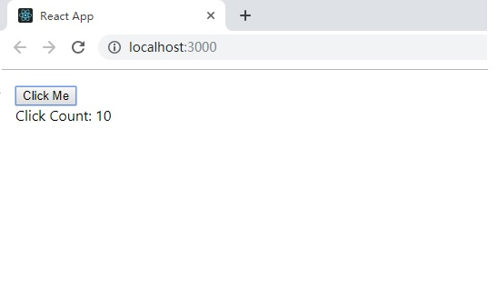

- 第1章

    - 启动
    
        安装node和npm，再安装create-react-app，通过`create-react-app first-react-app`，来创建一个名为
        first-react-app的项目，进入项目中，运行`npm start`启动项目，在浏览器中输入`localhost:8080`就能看到
        项目的页面了
        
        
    - 新增一个react组件
        
        react的首要思想是用组件来开发应用，观察[index.js](chapter-01/first_react_app/src/index.js)文件，中间代码如下
        ```
        import React from 'react';
        import ReactDOM from 'react-dom';
        import './index.css';
        import App from './App';
        import * as serviceWorker from './serviceWorker';
        
        ReactDOM.render(<App />, document.getElementById('root'));
        ```
        这段代码所做的事情就是渲染一个名叫App的组件，该组件被定义在了[App.js](chapter-01/first_react_app/src/App.js)中，该组件
        渲染出的效果就是上图中的界面。
        
        现在我们来自定义一个能够计算点击数的新组件，修改[index.js](chapter-01/first_react_app/src/index.js)
        ```
        import React from 'react';
        import ReactDOM from 'react-dom';
        import ClickCounter from './ClickCounter';
        import './index.css';
        
        ReactDOM.render(
          <ClickCounter/>,
          document.getElementById('root')
        );
        ```
        新增一个[ClickCounter.js](chapter-01/first_react_app/src/ClickCounter.js),此时的页面会进行热更新为
        
        一个带有交互功能的组件已经构建完成，现在来解析ClickCounter中的代码,先是在index.js中
        `import ClickCounter from './ClickCounter';`引入了该组件，在ClickCounter.js中的第一行
        `import React, { Component } from 'react';`来引入react库中的React和Component。
        
        Component是所有组件的基类，`class ClickCounter extends Component {...}`来声明一个组件类，而第一行引入的
        React类是用来处理组件中render()方法里的JSX表达式。
        
     -  JSX
     
        即JavaScript的语法扩展(eXtension),让我们在JavaScript中可以编写HTML代码，JSX中的元素不仅局限于HTML标签，也可以
        是React组件，例如index.js中的`ReactDOM.render(  <ClickCounter/>,  document.getElementById('root') );`中的第一个标签。
        
        *React判断一个元素是HTML还是React组件的原则就是看第一个字母是否大写！*
        
        JSX可以通过`onClick`来给元素添加一个事件的处理函数，之前的设计原则是把HTML、css和Js分开来管理，但在JSX中
        则是把实现同一个功能的代码集中在了一起。但是JSX中的onClick和HTML中直接写onclick还是有很大的区别，
        1. onclick是在全局环境下执行的，容易污染全局环境，产生意想不到的后果
        2. 为很多元素添加onclick会影响页面的性能，要处理的事件函数越多，性能越低。
        3. 删除包含onclick函数的元素，需要把对应的事件处理器注销，如果忘了注销会引起内存泄露。
        
        而JSX中的onClick则不存在上述问题，onClick挂载的每个函数都控制在组件范围内，不会污染全局空间，它是通过
        事件委托（event delegation）的方式处理点击事件，所有的点击事件都被同意挂载到DOM上一个顶级节点，然后根据
        点击的target分发给对应的元素。
        
        除了定义交互行为，也可以定义样式
        ```
            render() {
                const counterStyle = {
                    margin: '16px'
                }
                return (
                    <div style={counterStyle}>
                        <button onClick={this.onClickButton}>Click Me</button>
                        <div>
                            Click Count: <span id="clickCount">{this.state.count}</span>
                        </div>
                    </div>
                );
            }
        ```
    - 分解React应用
       
       观察[package.json](chapter-01/first_react_app/package.json),
       ```
          "scripts": {
            "start": "react-scripts start",
            "build": "react-scripts build",
            "test": "react-scripts test",
            "eject": "react-scripts eject"
          },
       ```
       可以看到，`npm start`其实调用了`react-scripts`这个命令，我们可以在node_module/react-scripts目录下看到，
       还有一个eject命令，通过`npm run eject`启动，运行之后会把一系列技术栈的配置弹射到应用的顶层。
       
    - React的工作方式
       
       如果用jQuery来实现上面的点击效果我们可能会写这么一段代码
       ```
        $(function() {
            $('#clickMe').click(function(){
                var clickCounter = $('#clickCount);
                var count = parsrInt(clickCounter.text(),10);
                clickCounter.text(count+1);
            });
        });
       ```
       jQuery的解决方案是通过CSS的规则找到对应id的按钮。添加上匿名的处理函数，来修改对应DOM元素的文本，这样的代码直观且
       易于理解，但是项目规模增大之后会造成代码结构复杂难以维护。
       
       而React则无需一步一步来手动实现这个过程，只需要告诉React我想要什么样的显示效果即可。它的理念，总结起来就是
       `UI=rendern(data)`,用户看到的界面UI一个应该是函数render的执行结果，对于开发者而言，应该区分哪些是render，哪些是data。
       这就是响应式编程(Reactive Programming)的思想。
       
    - Virtual DOM
           
       要了解虚拟DOM就要先了解DOM，DOM是结构化文本的抽象表达形式，HTML中的每个元素都对应DOM中的一个节点，形成了一个树形
       的结构，成为DOM树。浏览器会根据DOM树渲染出用户看到的界面，当需要改变界面时，就回去改变DOM树上的节点。在前端
       开发时，需要尽量减少DOM操作。即使是一句简单的JS语句，浏览器也需要对网页重新布局，重新绘制。
       
       JSX虽然看起来是HTML，但最终会被Babel解析为一条条创建React组件或者HTML元素的语句，React并不是通过这些
       语句直接构建DOM树，而是先构建一个虚拟DOM。
       
       虚拟DOM并不涉及浏览器的部分，只是一个JavaScript空间的树形结构，每次渲染组件时，会对比这次产生的虚拟DOM和
       上一次渲染的虚拟DOM，发现两棵虚拟DOM树的区别，然后一次性将这些差别修改到真正的DOM树上。

- 第2章 设计高质量的React组件

     - React组件的数据
     
     React组件的数据分为两种，prop和state，无论prop或者state的改变，都可能引发组件的重新渲染。prop是组件
     对外的接口，state是组件的内部状态，对外用prop，对内用state。
     
     新建一个ControlPanel的项目来演示属性的使用。
     
     在React中，prop是从外部传递给组建的数据，一个React组件通过定义自己能接受的prop就定义了自己的
     对外的公共接口。每个组件都是独立的模块，组件之外的一切都是外部世界，外部世界需要通过prop来和组件
     对话。
     
     1. 给prop赋值
         ```
            <SampleButton 
                id="sample" borderWidth={2} onClick={onButtonClick}
                style={{color:"red"}}
            />
         ```
         在上面的代码中，创建了一个名为SampleButton的组件实例，使用了名为id、borderWidth、onClick
         和style的prop，目前来看，React和HTML元素的属性还很相似。不过React的prop除了可以是字符串，也可以是
         任意一种JavaScript支持的数据类型。borderWidth是数字，onClick是函数类型，style是一个对象，如果
         prop的值不是字符串时，就需要用`{}`来包住prop的值。
         
         外部世界要传递值给组件，最简单的方式就是通过prop，同样组件要把数据反馈给外部也用通过prop。函数类型的
         prop等于让父组件交给了子组件一个回调函数，子组件在恰当的实际调用函数类型的prop，带上必要的参数，就反过来
         把信息传递给了外部世界。
         
         对于Counter组件，父组件ControlPanel就是外部世界，看一下ControlPanel是如何用prop传递信息给
         Counter的
         ```
            class ControlPanel extends Component {
              render() {
                return (
                  <div>
                    <Counter caption="First" initValue="{0}"/>
                    <Counter caption="Second" initValue={10} />
                    <Counter caption="Third" initValue={20} />
                  </div>
                );
              }
            }
         ```
         ControlPanel组件包含了三个Counter组件实例，在ControlPanel的render函数中将这三个子组件用div包起来，
         因为React要求render只能返回一个元素。在每个Counter都有名为initValue和caption的prop。
     
     2. 读取prop的值：
         ```
        class Counter extends Component {
          constructor(props) {
            super(props);
        
            this.onClickIncrementButton = this.onClickIncrementButton.bind(this);
            this.onClickDecrementButton = this.onClickDecrementButton.bind(this);
        
            this.state = {
              count: props.initValue
            }
          }
          
            componentWillReceiveProps(nextProps) {
              console.log('enter componentWillReceiveProps ' + this.props.caption)
            }
         }
         ```
         如果一个组件需要定义自己的构造函数，则第一行一定要加上super来调用父类的构造函数。不加的话就无法通过
         this.props访问到父组件传递过来的props的值。
         
         在构造函数中通过props来获取传入的prop值，在其他方法中通过this.props来获取传入的值。
         
         React通过propTypes来限定传入的prop的规格
         ```
            Counter.propTypes = {
              caption: PropTypes.string.isRequired,
              initValue: PropTypes.number
            };
         ```
         这里规定了传入的caption是字符类型且是必须的，initValue则必须是数字类型。
         这种类型限定在开发阶段是有意义的，但是在生产环境下就可以去除了。
    
    - React的state
    
        state代表组件内部的状态。由于React组件不能修改传入的prop，所以需要记录自身数据变化，
        就要使用state。在Counter组件中，最初显示初始计数，这个数字来自prop，当用户点击按钮改变
        这个数字时就要Counter自己通过state来存储。
        
        1. 初始化statr
            ```
            coonstructor(props) {
                ...
                this.state = {
                    count: props.initValue || 0
                }
            }
            ```
            组件的state必须是一个javascript对象，因此哪怕只是一个数字类型也需要用对象进行封装。
        
        2. 读取和更新state
        
            通过给button挂载的onClick事件来处理state
            ```
              onClickIncrementButton() {
                this.setState({count: this.state.count + 1});
              }
            
              onClickDecrementButton() {
                this.setState({count: this.state.count - 1});
              }
            ```
            this.state可以读取到当前组件的state，但是要改变state的值必须通过this.setState函数，而不能
            直接修改state对应的属性的值，因为直接修改值不会驱动对组件的重新渲染。
            
     - prop和state对比
     
        1. prop用于定义外部接口，state用于记录内部状态
        2. prop的赋值在外部世界使用组件时，state的赋值在组件内部
        3. 组件不应该改变prop的值，而state存在的目的就是让组件改变
        
    - 组件的生命周期
    
        React严格规定了组件的生命周期，大致经理下面三个过程，装载过程，更新过程，卸载过程
        1. 装载过程：
            当组件第一次被渲染的时候，依次会经历如下的函数调用
            constructor、getInitialState、getDefaultProps、componentWillMount、render、componentDidMount。
            - constructor，也是ES6中每个类都会有的构造函数，不是所有组件都需要构造函数，除了以下的目的，一是
            初始化state，二是绑定成员函数的this环境
            ```
             constructor(props) {
                ...              
                this.onClickIncrementButton = this.onClickIncrementButton.bind(this);
                this.onClickDecrementButton = this.onClickDecrementButton.bind(this);
                ...
              }
            ```
            这样以确保方法被调用时始终指向当前实例。
            
            - getInitialState和getDefaultProps，用来初始化state和prop，只有在通过React.createClass方法创建组件时
            才会被调用，该方法已经被弃用。
            
            - render 返回一个JSX元素，交由React渲染
            
            - componentWillMount和componentDidMount，在装载过程中，componentWillMount会在调用render函数之前
            被调用，componentDidMount会在调用render函数之后被调用，这两个函数就像render的前哨和后卫，较为有用
            的是componentDidMount函数，当组件渲染完成时就会调用该方法，此时我们就可以利用注入jQuery之类的库
            来操作DOM元素。
        2. 更新过程
        
            当组件被装载到DOM树上之后，用户在网页上可以看到组件的第一印象，但是要提供更好的交互体验，就要让该组件可以
            随着用户操作改变展现的内容，当props或者state修改的时候，就会引发组件的更新过程。
            
            更新过程会依次调用下面的生命周期函数，其中render函数和装载过程一样没有差别，componentWillReceiveProps、
            shouldComponentUpdate、componentWillUpdate、render、componentDidUpdate。
            
            - componentWillReceiveProps(nextProps) ，当父组件调用render函数，无论props是否发生改变，都会
            出发子组件的这个函数，注意this.setState不会触发这个方法，否则就存在死循环了。其传入的参数nextProps
            是当前的最新值，this.props是操作前的值，两者不同才有必要通过setState更新组件。
            
            - shouldComponentUpdate(nextProps,nextState) 这可能是除了render之外最重要的一个函数，render决定了
            要渲染成什么样，而shouldComponentUpdate决定了组件是否需要渲染。
            
                render和shouldComponentUpdate也是唯二明确要求有返回值的函数。render函数的返回结果用于构造DOM对象，而shouldComponentUpdate函数返回
            一个布尔值，告诉React库这个组件在这次更新过程中是否要继续执行render。对于不需要渲染的组件阻止它的默认渲染可以提升整体效率。
            ```
              shouldComponentUpdate(nextProps, nextState) {
                return (nextProps.caption !== this.props.caption) ||
                    (nextState.count !== this.state.count);
              }
            ```
            通过nextProps和this.props以及nextState和this.state的对比来判断是否需要渲染。
            
            - componentWillUpdate和componentDidUpdate 如果上一个函数返回true，接下来就会调用这两个方法
            
        3. 卸载过程 
        
           React的卸载过程只涉及一个函数，componentWillUnmount，当组件将要从DOM树上删除之前，会调用这个方法，
           该方法适合做一些清理的工作。
            
            
            
            