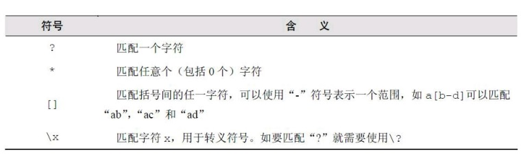

- 第1章 简介

  Redis是一个开源的高性能键值对数据库。它通过提供多种键值数据类型来适应不用场景下的存储需求，并借助许多高层级的
  接口使其可以胜任如缓存、队列系统等不同角色。
  
  - 存储结构
  
  有过开发经验的人对字典（或称映射、关联数组）数据结构一定很数据，类似`dict["key"]="value"`中的dict是一个
  字典结构变量，字符串key是键名，value是键值。在字典中我们可以获取或设置键名对应的键值，也可以删除一个键。
  
  Redis是Remote Dictionary Server（远程字典服务器）的缩写，它以字典数据结构存储数据，并允许其他应用通过
  TCP协议读写字典中的内容。Redis字典中的键值除了可以是字符串，还可以是其他数据类型，如下：
    - 字符串类型 
    - 散列类型
    - 列表类型
    - 集合类型
    - 有序集合类型
    这与MySQL中二维表形式的存储结构有很大的差异，假如我们要在post变量存储了一篇文章的数据（包括标题、正文、阅读量和标签）
    ```
    post["title"]="Hello World!"
    post["content"]="Blablabla..."
    post["views"]=0
    post["tags"]=["PHP","Ruby","Node.js"]
    ```
    如果这篇文章存储在数据库中，并要求可以通过标签搜索出文章。一般标题、正文、阅读量会放在一张表中，标签会保存在另一张表中，
    同时可能还会需要第三张表来保存标签和文章之间的关联关系，通过标签搜索文章时需要关联三张表，不是很直观。而Redis字典结构的
    存储方式和对多种键值数据的支持使得开发者可以将程序中的数据直接映射到Redis中。
    
    Redis数据库中的数据都存储在内存中，由于内存的读写速度远快于硬盘，因此在性能上对比其他硬盘存储的数据优势明显。不过当断电
    时内存中的数据会丢失，因此Redis可以将内存中的数据异步的写道硬盘中，同时不影响继续提供服务。
    
    Redis虽然是作为数据库开发的，但其也能被用于缓存、队列系统等。Redis可以为每个键设置生存时间（Time To Live，TTL），其也是另一缓存
    系统Memcached的有力竞争者。
    
    Redis提供了一百多个命令来操作数据库，常用的大约十几种且易于记忆。
    
- 第2章 安装

    略 具体操作参照https://blog.csdn.net/qq_32444825/article/details/80718650
    
- 第3章 入门

    本章将会详细介绍redis的五种数据类型及相应的命令。
    
    - 热身
    
    1. 获得符合规则的键名列表： KEYS pattern
    
    pattern支持如下的字符
    
    
    2. 判断键值是否存在：EXISTS key，返回1为存在，0为不存在
    
    3. 删除键：DEL key1 key2，返回值时删除的键的个数
    
    4. 获得键值的数据类型： TYPE key
  
    - 字符串类型
    
    最基本的数据类型，能存储任何形式的字符串，包括二进制数据。你可以用来存储JSON对象甚至是图片，一个字符串
    类型的键允许存储的数据的最大容量是512Mb（3.0版本以前）
    
    - 命令
    1. 赋值：SET key value
    2. 取值：GET key，若键不存在会返回空值
    3. 递增数字：INCR key，键值为整型会自增，键值为空会变为1，键值不是整型则会报错，在关系型数据库中我们可以通过设置字段属性为AUTO_INCREMENT来实现每增加一条记录自动生成一个唯一
    的递增ID的目的，而在Redis中，对于每一类对象使用名为对象类型：count的键（如users:count）来存储当前对象的数量，
    每增加一个新对象都是用INCR命令递增该键的值，返回的数字即是当前对象的总数，也是新增加对象的id。
    
    4. 增加指定的整数：INCRBY key increment
    5. 减少指定的整数：DECR key decrement
    6. 增加指定浮点数：INCRBYFLOAT key increment
    7. 向尾部追加值：APPEND key value，向键值的末尾添加value，返回值是追加后的字符串的总长度
    8. 获取字符串长度：STRLEN key
    9. 同时获得和设置多个键值对：
          ```
          MGET key1 key2
          MSET key1 v1 key2 v2
          ```
          
    10. 位操作：
    ```
    GETBIT key offset
    SETBIT key offset value
    BITCOUNT key [start] [end]
    BITOP operation destkey key [key …]
    ```
    Redis提供了四个命令直接操作键值的二进制的值
    
    - 散列类型
    
    散列（hash）类型的键值也是一种字典结构，其存储了字段（field）和字段值的映射，但字段值只能是字符串，不支持其他类型。
    
    - 命令
    1. 赋值与取值：
        ```
        HSET key field value
        HGET key field
        HMSET key field value field value ...
        HMGET key field field
        HGETALL key
        ```
        HSET命令在字段不存在时执行插入，存在则执行更新，键不存在则自动建立
    
    2. 判断字段是否存在：HEXISTS key field
    3. 当字段不存在时赋值：HSETNX key field value，与HSET的区别时如果字段已存在不会进行更新
    4. 增加数字：HINCRBY key field increment
    5. 删除字段：HDEL key field1 field2...
    6. 只获取字段名或字段值：HKEYS key ，HVALS key
    7. 获取字段数量：HLEN key
    
    - 列表类型
    
    列表类型可以存储一个有序的字符串列表，常用的操作时向列表两端添加元素，或者获得列表的一个片段。列表类型内部是使用双向链表（double linked list）
    实现的，所以向列表两端添加元素的时间复杂度都为O(1)，获取越接近两端的元素也会越快。这意味这从有几千万元素的列表中取头10条记录的速度也是
    极快的。
    - 命令
    1. 向列表两端增加元素：
    ```
    LPUSH key value1 value2
    RPUSH key value1 value2
    ``` 
    2. 从列表两端弹出元素
    ```
    LPOP key
    RPOP key
    ```
    3. 获取列表中元素的个数：LLEN key
    4. 获得列表的片段：LRANGE key start end
    4. 删除列表中的指定值:LREM key count value，删除列表中前count个值为value的元素
    5. 获得/设置指定索引的元素值：LINDEX key index，LSET key index value
    6. 只保留列表指定片段：LTRIM key start end
    7. 向列表中插入元素：LINSERT key BEFORE|AFTER pivot value
    8. 将元素从一个列表中转义到另一个列表：RPOPLPUSH source destination
    
    - 集合类型
    
    集合的概念在高中就徐熙过，集合中的元素各不相同，且没有顺序。集合常用的操作是向集合中加入或删除元素，判断元素是否存在等，由于
    集合在Redis内部是使用散列表（HashTable）实现的，所以这些操作的时间复杂度都是O(1)。多个集合类型的键之间
    可以进行并集、交集和差集运算。
    
    - 命令
    1. 增加/删除元素：
    ```
    SADD key member1 member2
    SREM key member1 member2
    ```
    2. 获得集合中的所有元素：SMEMBERS key
    3. 判断元素是否在集合中：SISMEMBER key member
    4. 集合间运算：
    ```
    SDIFF key key ... //对多个集合进行差集元素 A-B
    SINTER key key ...//对多个集合进行交集运算 A∩B
    SUNION key key ...//对多个集合执行并集运算 A∪B
    ```
    5. 获得集合中元素个数：SCARD key
    6. 进行集合运算并将结果存储
    ```
    SDIFFSTORE destionation key key 
    SINTERSTORE destionation key key 
    SUNIONSTORE destionation key key  
    ```
    7. 随机获得集合中的元素：SRANDMEMBER key [count]
    8. 从集合中弹出一个元素：SPOP key
    
    - 有序集合类型
    
    有序集合类型（sorted set）与上一个集合类型唯一的区别就是有序。在集合类型的基础上为每一个集合中的元素都
    关联了一个分数，我们可以按照需要获得分数最高（或最低）的前N个元素。
    有序集合是使用散列表和跳跃表（Skip list）实现的，所以即使读取位于中间的数据速度也很快（时间复杂度是O(log(N))）。
    
    - 命令
    1. 增加元素：ZADD key score1 member1 score2 member2
    2. 获得元素的分数：ZSCORE key member
    3. 获得排名在某个范围的元素列表：
    ```
    ZRANGE key start stop [WITHSCORES]
    ZREVRANGE key start stop [WITHSCORES]
    ```
    4. 获得指定分数范围的元素：ZRANGEBYSCORE key min max
    5. 增加某个元素的分数：ZINCRBY key increment member
    6. 获得集合中元素的数量：ZCARD key
    7. 获得指定分数范围内的元素个数：ZCOUNT key min max
    8. 删除一个或多个元素：ZREM key member1 member2
    9. 按照排名范围删除元素：ZREMRANGEBYRANK key start stop
    10. 按照分数范围删除元素： ZREMRANGEBYSCORE key min max
    11. 获得元素的排名：ZRANK key member，ZREVRANK key member
    
- 第4章 进阶

    - 事务
    
    Redis中的事务(transaction)是一组命令的集合。
    Redis通过输入`MULTI`来开启一个事务，依次输入要执行的指令，输入完之后通过`EXEC`来执行事务。
    错误处理：
    (1)语法错误 如果事务中有命令存在语法错误则不会执行；
    (2)运行错误 如果在执行过程种有一条命令出现错误，那么之后的指令会继续执行，因为Redis没有提供
    事务回滚的机制，你需要手动来将数据的状态恢复到事务执行之前。

    
    
    
    
    
    