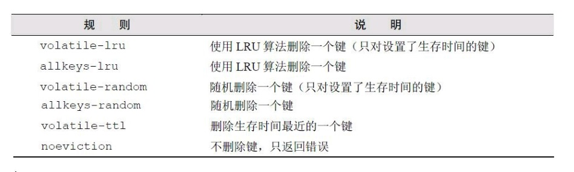
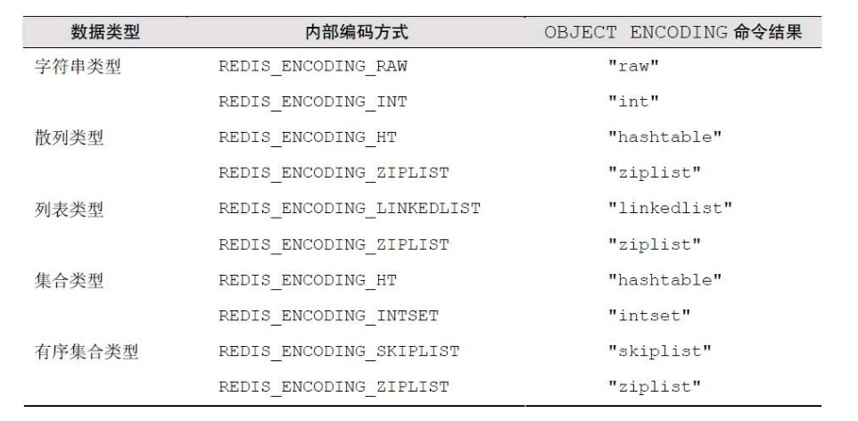
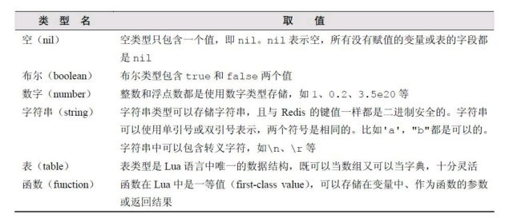
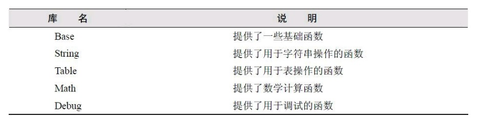
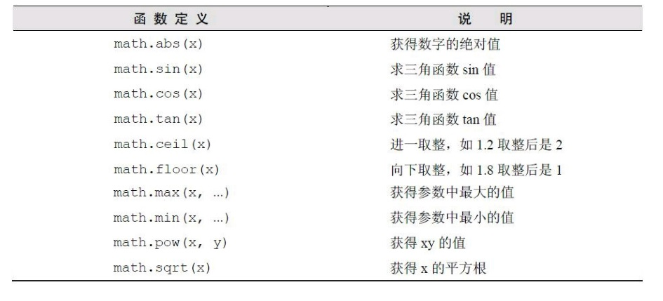

- 第1章 简介

  Redis是一个开源的高性能键值对数据库。它通过提供多种键值数据类型来适应不用场景下的存储需求，并借助许多高层级的
  接口使其可以胜任如缓存、队列系统等不同角色。
  
  - 存储结构
  
  有过开发经验的人对字典（或称映射、关联数组）数据结构一定很数据，类似`dict["key"]="value"`中的dict是一个
  字典结构变量，字符串key是键名，value是键值。在字典中我们可以获取或设置键名对应的键值，也可以删除一个键。
  
  Redis是Remote Dictionary Server（远程字典服务器）的缩写，它以字典数据结构存储数据，并允许其他应用通过
  TCP协议读写字典中的内容。Redis字典中的键值除了可以是字符串，还可以是其他数据类型，如下：
    - 字符串类型 
    - 散列类型
    - 列表类型
    - 集合类型
    - 有序集合类型
    这与MySQL中二维表形式的存储结构有很大的差异，假如我们要在post变量存储了一篇文章的数据（包括标题、正文、阅读量和标签）
    ```
    post["title"]="Hello World!"
    post["content"]="Blablabla..."
    post["views"]=0
    post["tags"]=["PHP","Ruby","Node.js"]
    ```
    如果这篇文章存储在数据库中，并要求可以通过标签搜索出文章。一般标题、正文、阅读量会放在一张表中，标签会保存在另一张表中，
    同时可能还会需要第三张表来保存标签和文章之间的关联关系，通过标签搜索文章时需要关联三张表，不是很直观。而Redis字典结构的
    存储方式和对多种键值数据的支持使得开发者可以将程序中的数据直接映射到Redis中。
    
    Redis数据库中的数据都存储在内存中，由于内存的读写速度远快于硬盘，因此在性能上对比其他硬盘存储的数据优势明显。不过当断电
    时内存中的数据会丢失，因此Redis可以将内存中的数据异步的写道硬盘中，同时不影响继续提供服务。
    
    Redis虽然是作为数据库开发的，但其也能被用于缓存、队列系统等。Redis可以为每个键设置生存时间（Time To Live，TTL），其也是另一缓存
    系统Memcached的有力竞争者。
    
    Redis提供了一百多个命令来操作数据库，常用的大约十几种且易于记忆。
    
- 第2章 安装

    略 具体操作参照https://blog.csdn.net/qq_32444825/article/details/80718650
    
- 第3章 入门

    本章将会详细介绍redis的五种数据类型及相应的命令。
    
    - 热身
    
    1. 获得符合规则的键名列表： KEYS pattern
    
    pattern支持如下的字符
    
    
    2. 判断键值是否存在：EXISTS key，返回1为存在，0为不存在
    
    3. 删除键：DEL key1 key2，返回值时删除的键的个数
    
    4. 获得键值的数据类型： TYPE key
  
    - 字符串类型
    
    最基本的数据类型，能存储任何形式的字符串，包括二进制数据。你可以用来存储JSON对象甚至是图片，一个字符串
    类型的键允许存储的数据的最大容量是512Mb（3.0版本以前）
    
    - 命令
    1. 赋值：SET key value
    2. 取值：GET key，若键不存在会返回空值
    3. 递增数字：INCR key，键值为整型会自增，键值为空会变为1，键值不是整型则会报错，在关系型数据库中我们可以通过设置字段属性为AUTO_INCREMENT来实现每增加一条记录自动生成一个唯一
    的递增ID的目的，而在Redis中，对于每一类对象使用名为对象类型：count的键（如users:count）来存储当前对象的数量，
    每增加一个新对象都是用INCR命令递增该键的值，返回的数字即是当前对象的总数，也是新增加对象的id。
    
    4. 增加指定的整数：INCRBY key increment
    5. 减少指定的整数：DECR key decrement
    6. 增加指定浮点数：INCRBYFLOAT key increment
    7. 向尾部追加值：APPEND key value，向键值的末尾添加value，返回值是追加后的字符串的总长度
    8. 获取字符串长度：STRLEN key
    9. 同时获得和设置多个键值对：
          ```
          MGET key1 key2
          MSET key1 v1 key2 v2
          ```
          
    10. 位操作：
    ```
    GETBIT key offset
    SETBIT key offset value
    BITCOUNT key [start] [end]
    BITOP operation destkey key [key …]
    ```
    Redis提供了四个命令直接操作键值的二进制的值
    
    - 散列类型
    
    散列（hash）类型的键值也是一种字典结构，其存储了字段（field）和字段值的映射，但字段值只能是字符串，不支持其他类型。
    
    - 命令
    1. 赋值与取值：
        ```
        HSET key field value
        HGET key field
        HMSET key field value field value ...
        HMGET key field field
        HGETALL key
        ```
        HSET命令在字段不存在时执行插入，存在则执行更新，键不存在则自动建立
    
    2. 判断字段是否存在：HEXISTS key field
    3. 当字段不存在时赋值：HSETNX key field value，与HSET的区别时如果字段已存在不会进行更新
    4. 增加数字：HINCRBY key field increment
    5. 删除字段：HDEL key field1 field2...
    6. 只获取字段名或字段值：HKEYS key ，HVALS key
    7. 获取字段数量：HLEN key
    
    - 列表类型
    
    列表类型可以存储一个有序的字符串列表，常用的操作时向列表两端添加元素，或者获得列表的一个片段。列表类型内部是使用双向链表（double linked list）
    实现的，所以向列表两端添加元素的时间复杂度都为O(1)，获取越接近两端的元素也会越快。这意味这从有几千万元素的列表中取头10条记录的速度也是
    极快的。
    - 命令
    1. 向列表两端增加元素：
    ```
    LPUSH key value1 value2
    RPUSH key value1 value2
    ``` 
    2. 从列表两端弹出元素
    ```
    LPOP key
    RPOP key
    ```
    3. 获取列表中元素的个数：LLEN key
    4. 获得列表的片段：LRANGE key start end
    4. 删除列表中的指定值:LREM key count value，删除列表中前count个值为value的元素
    5. 获得/设置指定索引的元素值：LINDEX key index，LSET key index value
    6. 只保留列表指定片段：LTRIM key start end
    7. 向列表中插入元素：LINSERT key BEFORE|AFTER pivot value
    8. 将元素从一个列表中转义到另一个列表：RPOPLPUSH source destination
    
    - 集合类型
    
    集合的概念在高中就徐熙过，集合中的元素各不相同，且没有顺序。集合常用的操作是向集合中加入或删除元素，判断元素是否存在等，由于
    集合在Redis内部是使用散列表（HashTable）实现的，所以这些操作的时间复杂度都是O(1)。多个集合类型的键之间
    可以进行并集、交集和差集运算。
    
    - 命令
    1. 增加/删除元素：
    ```
    SADD key member1 member2
    SREM key member1 member2
    ```
    2. 获得集合中的所有元素：SMEMBERS key
    3. 判断元素是否在集合中：SISMEMBER key member
    4. 集合间运算：
    ```
    SDIFF key key ... //对多个集合进行差集元素 A-B
    SINTER key key ...//对多个集合进行交集运算 A∩B
    SUNION key key ...//对多个集合执行并集运算 A∪B
    ```
    5. 获得集合中元素个数：SCARD key
    6. 进行集合运算并将结果存储
    ```
    SDIFFSTORE destionation key key 
    SINTERSTORE destionation key key 
    SUNIONSTORE destionation key key  
    ```
    7. 随机获得集合中的元素：SRANDMEMBER key [count]
    8. 从集合中弹出一个元素：SPOP key
    
    - 有序集合类型
    
    有序集合类型（sorted set）与上一个集合类型唯一的区别就是有序。在集合类型的基础上为每一个集合中的元素都
    关联了一个分数，我们可以按照需要获得分数最高（或最低）的前N个元素。
    有序集合是使用散列表和跳跃表（Skip list）实现的，所以即使读取位于中间的数据速度也很快（时间复杂度是O(log(N))）。
    
    - 命令
    1. 增加元素：ZADD key score1 member1 score2 member2
    2. 获得元素的分数：ZSCORE key member
    3. 获得排名在某个范围的元素列表：
    ```
    ZRANGE key start stop [WITHSCORES]
    ZREVRANGE key start stop [WITHSCORES]
    ```
    4. 获得指定分数范围的元素：ZRANGEBYSCORE key min max
    5. 增加某个元素的分数：ZINCRBY key increment member
    6. 获得集合中元素的数量：ZCARD key
    7. 获得指定分数范围内的元素个数：ZCOUNT key min max
    8. 删除一个或多个元素：ZREM key member1 member2
    9. 按照排名范围删除元素：ZREMRANGEBYRANK key start stop
    10. 按照分数范围删除元素： ZREMRANGEBYSCORE key min max
    11. 获得元素的排名：ZRANK key member，ZREVRANK key member

- 第4章 进阶

    - 事务
    
    Redis中的事务（transaction）是一组命令的集合。事务同命令一样都是Redis的最小执行单位，一个
    事务中的命令要么都执行，要么都不执行。事务的应用非常普遍，如银行转账过程中A给B汇款，两个步骤必须
    属于同一个事务，要么全执行，要么全不执行。
    通过`MULTI`命令告诉Redis，下面所有的命令属于同一个事务，先不执行，暂存起来。当一个事务中所有命令
    都发送完毕，执行`EXEC`命令，告诉Redis执行事务。
    
    错误处理，当事务中多个命令中的某一个出现错误的时候，Redis会怎样处理某一条命令执行出错。
    
    (1)语法错误，执行EXEC后会直接返回错误，不会执行。
    
    (2)运行错误，运行错误指在命令执行时出现的错误，错误的命令之后的代码会继续执行，因为Redis的
    事务没有提供类似关系型数据库中的回滚（rollback）功能。为此开发者必须在事务执行出错后自己收拾
    剩下的摊子（将数据库复原回事务执行前的状态等）。
    
- 第4章 进阶

    - 事务
    
    Redis中的事务(transaction)是一组命令的集合。
    Redis通过输入`MULTI`来开启一个事务，依次输入要执行的指令，输入完之后通过`EXEC`来执行事务。
    错误处理：
    (1)语法错误 如果事务中有命令存在语法错误则不会执行；
    (2)运行错误 如果在执行过程种有一条命令出现错误，那么之后的指令会继续执行，因为Redis没有提供
    事务回滚的机制，你需要手动来将数据的状态恢复到事务执行之前。

    Watch命令可以监控一个或多个键，一旦其中有一个键被修改（或删除），之后的事务就不会执行。监控
    一致持续到EXEC命令。
    ```
    redis＞SET key 1
    OK
    redis＞WATCH key
    OK
    redis＞SET key 2
    OK
    redis＞MULTI
    OK
    redis＞SET key 3
    QUEUED
    redis＞EXEC
    (nil)
    redis＞GET key
    "2"
    ```
    上例在执行WATCH命令后、事务执行前修改了key的值（即SET key 2），所以事务中的SET key 3没有执行。
    
    生存时间 Redis中可以使用EXPIRE命令设置一个键的生存时间，到期之后Redis会自动删除它。EXPIRE命令的
    使用方法为EXPIRE key seconds，其中seconds参数表示键的生存时间，单位是秒。返回值1说明设置成功。
    
    如果想知道一个键还有多久会被删除，可以使用TTL命令。TTL key，返回值是秒。当键不存在则返回-1。
    
    如果想取消键的生存时间设置（将键恢复为永久），可以使用PERSIST命令。除此之外使用SET或GETSET为键
    赋值的同时也可以清空生存时间的限制。其他对键值的操作均不会影响生存时间。
    
    - 实现缓存
    
    为了提高网站的负载能力，常常需要把一些访问频率较高但是对CPU和IO资源消耗较大的操作的结果缓存起来，并
    让这些缓存过一段时间能自动过期。
    为了防止缓存过大占用内存，可以修改配置文件的maxmemory参数，限制Redis最大的可用内存，当超出时会执行策略
    来删除不需要的键，Redis支持的删除策略包括
   
    
   - 排序
   
   SORT命令可以对列表类型、集合类型、有序集合类型键排序，并且可以完成与关系数据库中的
   连接查询相似的任务。
   ```
    redis＞LPUSH mylist 4 2 6 1 3 7
    (integer)6
    redis＞SORT mylist
    1) "1"
    2) "2"
    3) "3"
    4) "4"
    5) "6"
    6) "7"
    
    redis＞ZADD myzset 50 2 40 3 20 1 60 5
    (integer) 4
    redis＞SORT myzset
    1) "1"
    2) "2"
    3) "3"
    4) "5"
    
    redis＞LPUSH mylistalpha a c e d B C A
    (integer) 7
    redis＞SORT mylistalpha
    (error) ERR One or more scores can't be converted into double
    redis＞SORT mylistalpha ALPHA
    1) "A"
    2) "B"
    3) "C"
    4) "a"
    5) "c"
    6) "d"
    7) "e"
    //如果没有加ALPHA参数的话，SORT命令会尝试将所有元素转换
    //成双精度浮点数来比较，如果无法转换则会提示错误
   ```
   
   - BY参数
   
   很多情况下列表（或集合、有序集合）中存储的元素值代表的是对象的ID，单纯对ID自身排序的意义不大。更多的时候
   我们希望根据ID对应的对象的某个属性进行排序。这时就需要SORT命令的一个参数`BY`
   ```
    redis＞LPUSH sortbylist 2 1 3
    (integer) 3
    redis＞SET itemscore:1 50
    OK
    redis＞SET itemscore:2 100
    OK
    redis＞SET itemscore:3 -10
    OK
    redis＞SORT sortbylist BY itemscore:＊ DESC
    1) "2"
    2) "1"
    3) "3"
   ```
   
   - STROE参数
   
   默认情况下SORT会直接返回排序的结果，如果希望将排序结果保存，在要配合SROTE参数
   `SORT tag:ruby:posts BY post:＊-＞time DESC GET post:＊-＞title GET post:＊-
    ＞time
    GET # STORE sort.result`
    
    - 性能优化
    
    SORT如果使用不好很容易成为性能瓶颈。SORT命令的时间复杂度是O(n+mlogm)，其中n是要排序的列表中元素的个数，
    m是要返回的元素的个数。当n越大性能越低。
    
    所以在使用SORT时需要注意：
    1. 尽可能减少待排序的元素的数量
    2. 使用LIMIT参数直获取少量需要的数据
    3. 如果排序的数据量较大，尽可能使用STORE参数来将结果缓存
    
    - 任务队列
    
    使用任务队列的好处是
    
    （1）松耦合。生产者和消费者无需知道彼此的实现细节，只需要约定好任务的描述格式。这使得生产者和消费者
    可以由不同的团队使用不同的编程语言编写。
    
    （2）易于扩展消费者，而且可以分布在不同的服务器中
    
    如果要实现任务队列，只需要让生产者将任务使用LPUSH加入到某个键中，另一边的消费者使用RPOP命令从键中获取任务即可。
    
   - 发布/订阅模式
   
   Redis提供了一组命令来实现发布/订阅模式。该模式包含两个角色，分别是发布者和订阅者，订阅者可以订阅若干个频道，
   而发布者可以向指定频道发送消息。
   发布者发布消息的命令式`PUBLISH channel message`，订阅频道的命令是`SUBSCRIBE channel1 channel2`，
   
   执行了SUBSCRIBE命令后客户端进入订阅模式，此时将不能使用除了`SUBSCRIBE/UNSUBSCRIBE/PSUBSCRIBE/PUNSUBSCRIBE`
   之外的命令，否则会报错。
   
   除了使用SUBSCRIBE命令订阅指定名称的频道之外，还可以使用PSUBSCRIBE命令订阅指定的规则。规则支持glob风格
   的通配符。
   `PSUBSCRIBE channel.?*`中的规则`channel.?*`可以匹配channel1.1和channel1.10
   
   - 管道
   
   客户端和Redis使用TCP协议连接。不论是客户端向Redis发送命令还是Redis向客户端返回命令的执行结果，都是通过网络
   传输，这两个部分的往返的总耗时称为往返时延。根据网络性能不同，往返时延也不同。在执行命令时每条命令都需要等待
   上一条命令执行完收到返回结果才能执行。
   
   Redis底层的通信协议对管道提供了支持。通过管道可以一次性发送多条命令，并在执行完后一次性将结果返回，当一组命令中
   每一条都不依赖其他命令的返回结果时，就可以把这组命令一起通过管道发出。管道通过减少客户端与Redis的通信次数来减少
   往返时延。
   
   - 节省空间
   
   Redis是一个基于内存的数据库，所有数据都存储在内存中，减少内存空间占用对成本控制来说是一个非常重要的话题。
   1. 精简键名和键值。需要把握好易理解和精简之间的尺度
   2. 内部编码优化
   
   
- 第5章 实践

    本章将会通过实例介绍Redis的Node.js客户端的使用方法。
    ```
    var redis = require('redis')
    var client = redis.createClient('6379', '127.0.0.1');
    client.set('foo', 'bar', function () {
    //此时SET命令执行完并返回结果，
    //因为这里并不关心SET命令的结果，所以我们省略了回调函数的形参。
    	client.get('foo', function (error, fooValue) {
    	//error 参数存储了命令执行时返回的错误信息，如果没有错误则返回null。
    	//回调函数的第二个参数存储的是命令执行的结果
    	console.log(fooValue); // 'bar'
    	});
    });
    ```
    
    
    
- 第6章 脚本

Redis2.6推出了脚本功能，允许开发者使用Lua语言编写脚本传到Redis中执行。在Lua脚本中可以执行大部分的
Redis命令。使用脚本的好处有
1. 减少网络开销和往返时延，因为只需要发送一次脚本请求即可
2. 原子操作，Redis会将脚本当作一个整体执行，中间不会被插入其他命令，因此无需手动管理事务
3. 服用，其他客户端可以对脚本进行复用

    - Lua语言
    
    Lua是一个高效的轻量级脚本语言。Redis使用Lua5.1版本。本节不会完整的介绍Lua语言，只包含在Redis脚本
    中会用到的部分。
    
    
    Lua的变量分为全局变量和局部变量，全局变量无需声明可以直接使用，默认值是nil。
    ```
    a=1 --为全局变量a赋值
    print(b) --无需声明即可使用，默认值是nil
    a=nil --删除全局变量a的方法是将其赋值为nil。全局变量没有声明和未声明之分，只
    有非nil和nil的区别
    ```
    
    Redis脚本中不能使用全局变量以防止脚本之间相互影响，声明局部变量的方法是加上`local`关键词，
    局部变量的作用域是从声明开始到所在层的语句块结尾
    ```
    local x=10
    if true then
        local x=x + 1   
        print(x)    //11
        do
            local x=x + 1    
            print(x)    //12
        end
        print(x)    //11
    end
        print(x)    //10
    打印结果为：
    11
    12
    11
    10
    ```
    
    - 注释 
    
    Lua的注释有单行和多行两种，单行注释以`--`开始，多行注释以`--[[`开始，到`]]`结束
    
    - 赋值
    
    Lua支持多重赋值
    ```
    local a, b=1, 2 --a的值是1，b的值是2
    local c, d=1, 2, 3 --c的值是1，d的值是2，3被舍弃了
    local e, f=1 --e的值是1，f的值是nil
    ```
    
    - 操作符
    
    Lua有以下5类操作符
    (1) 数学操作符 （2）比较操作符 （3）逻辑操作符 （4）连接操作符`..` （5）取长度操作符`#`
    
    - if语句
    ```
    if 条件表达式 then
        语句块
    elseif 条件表达式 then
        语句块
    else
        语句块
    end
    ``` 
    注意Lua中只有nil和false是假，其余都是真值，所以当用EXISTS来判断键是否存在，即使返回0也代表真值
    
    - 循环语句
    
    Lua支持while，repeat和for循环语句。
    ```
    while 条件表达式 do
        语句块
    end
    
    repeat 
        语句块
    until 条件表达式
    
    for 变量=初值, 终值, 步长 do
        语句块
    end
    
    for变量1,变量2,...,变量N in迭代器do
    语句块
    end
    ```
    
    - 表类型
    
    表是Lua中唯一的数据结构，可以理解为关联数组，任何类型的值（除了空类型）都可以作为表的索引。
    ```
    a={} --将变量a赋值为一个空表
    a['field']='value' --将field字段赋值value
    print(a.field) --打印内容为'value'，a.field是a['field']的语法糖。
    
    people={ --也可以这样定义
    name='Bob',
    age=29
    }
    print(people.name) --打印的内容为'Bob'
    ```
    
    - 函数
    
    函数的定义为
    ```
    function(参数列表)
        函数体
    end
    ```
    可以将函数赋值给一个局部变量
    ```
    local function square (num)
        return num ＊ num
    end
    //这段代码等价于
    local square
    square=function(num)
        return num ＊ num
    end
    ```
    
    - 标准库
    
    Lua的标准库提供了很多实用的函数
    
    1. String库
        ```
        string.len(string)
        string.lower(string)
        string.upper(string)
        string.sub(string,start[,end])
        ```
    2. Table库
        ```
        table.concat(table[,sep[,i[,j]]]) --将一个数组转换成字符串
        table.insert(table, [pos,] value) --向数组中插入元素
        table.remove(table [, pos])       --从数组中弹出一个元素
        ```
    3. Math库
    
    
    - 在脚本中调用Redis命令
    ```
    redis.call('set', 'foo', 'bar')
    local value=redis.call('get', 'foo') --value的值为bar
    ```
    - 在Redis中调用脚本
    Redis提供了EVAL命令来像调用内置命令一样调用脚本，格式是:
    `EVAL script numkeys key [key ...] arg [arg ...]` 
    
- 第7章 管理

    - 持久化 
    
    将Redis中的数据从内存中同步到硬盘上的过程就是持久化，主要有两种形式
    1. RDB方式
    
        通过快照（snapshotting）完成，当符合一定条件时Redis会自动将内存中的
        数据进行快照并存储到硬盘上。进行快照的条件由用户在配置文件中自定义，由
        两个参数构成：时间和改动的键的个数。当在指定时间内更改的键的个数大于指定
        的数值时就会进行快照。
        
        在配置中已经预置了3个条件：
        ```
        save 900 1
        save 300 10
        save 60 10000
        ```
        Redis默认将快照文件本存在当前目录的dump.rdb文件中，可以通过dir和dbfilename
        来指定。
        
        Redis快照的过程如下：
        （1）Redis使用fork函数复制一份当前进程（父进程）的副本（子进程）；
        （2）父进程继续接收并处理客户端发来的命令，而子进程开始将内存中的数据写入硬盘中
        的临时文件；
        （3）当子进程写入完所有数据后会用该临时文件替换旧的RDB文件，至此一次快照操作完
        成。
        
        除了自动快照，可以通过SAVE或BGSAVE来让Redis执行快照。
    
    2. AOF方式
    
        默认情况下Redis没有开启AOF（append only file）方式的持久化，可以通过
        appendonly参数开启，开启之后，买执行一条命令就会将该命令写入硬盘中的
        AOF文件。AOF文件的保存位置和RDB一致
        
    - 复制
    
    Redis提供了复制的功能，可以自动将更新的数据同步到其他的服务器上。同步后的数据库分为两类，
    主数据库（master），一类时从数据库（salve），主数据库有读写权限，发生写操作时会
    将数据同步给从数据库。而从数据库一般是只读的，并能接收主数据库同步过来的数据。主数据库
    有一个，从数据库可以有多个。
    
    在Redis中使用复制功能非常容易，只需要在从数据库的配置文件中加入“slaveof 主数据库IP 主数据库端口”即可，主数据库无需进行任何配置。
    
    原理：
    当一个从数据库启动后，会向主数据库发送SYNC命令，主数据库接收到SYNC命令后会
    开始在后台保存快照（即RDB持久化的过程），并将保存期间接收到的命令缓存起来。当快照
    完成后，Redis会将快照文件和所有缓存的命令发送给从数据库。从数据库收到后，会载入快
    照文件并执行收到的缓存的命令。当主从数据库断开重连后会重新执行上述操作，不支持断
    点续传。

    通过复制功能可以实现读写分离，以提高服务器的负载能力，主数据库负责写数据，而读数据从从数据库。
    
    - 安全
    
    可以通过配置文件中的requirepass参数为Redis设置一个密码。例如：
    requirepass TAFK(@~!ji^XALQ(sYh5xIwTn5D s7JF
    
    - 管理工具
    
    下面介绍几个管理Redis时常用的命令：
    1. 耗时命令日志：当一条命令执行时间超过限制时，Redis会将该命令的执行时间等信息加入耗时命令日志（slow log）
    以供开发者查看。可以通过slowlog-log-slower-than参数设置这一限制，注意单位是微秒，默认是10000。
    
    2. 命令监控：Redis提供了MONITOR命令来监控Redis执行的所有命令，redis-cli同样支持该命令，这时Redis执行的
    所有命令都会在redis-cli中打印出来。
   
   MONITOR命令非常影响Redis的性能，降低接近一半的负载能力。所以该命令只适合用来调试和纠错。
    
   
    
    
  
  