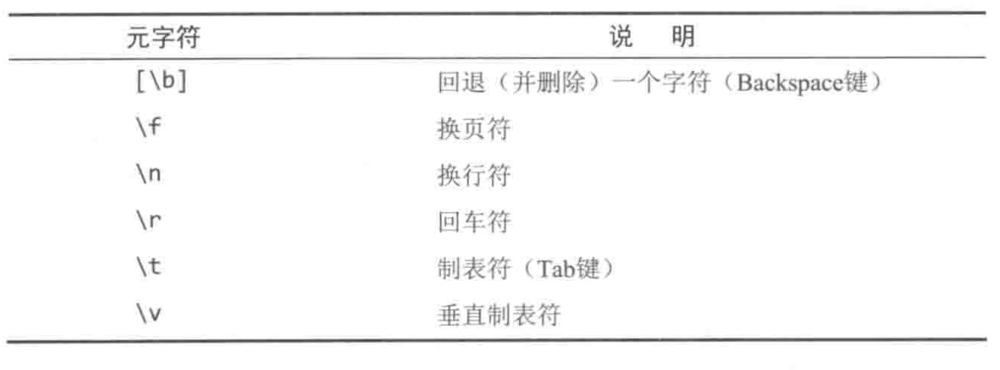

#### 《正则表达式必知必会》

- 引言

    正则表达式（Regular Expression）已经出现了很多年，它可以用来完成各种复杂的文本处理
    工作，更重要的是，几乎所有程序设计语言和平台都支持。我们将会从简单的文本匹配开始，循序渐进的设计
    一些复杂的专题，包括回溯引用(backreference)、条件性求值(conditional evaluaion)和前后查找(lookingaround)等
    
- 第1章 入门

    正则表达式（Regular Expression，regex）是一种工具，为了解决一类专门的问题而发明的，包含
    查找特定的信息（搜索）和查找并编辑特定的信息（替换）。简单的说，正则就是用来匹配和处理文本的字符串。
    
    以下都是合法的正则表达式
   ```
   Ben
   .
   www\.forta\.com
   [a-zA-Z0-9_.]*
   <[Hh]1>.*</[Hh]>
   \r\n\r\n
   \d{3,3}-\d{3,3}-\d{4,4}
    ```
    语法是正则表达式中最容易掌握的部分，真正的挑战是学会运用语法解决实际问题。
    本书提供了一个小工具来帮助可视化的匹配正则
    [regextester.html](regextester.html)
    
- 第2章 匹配单个字符
    
    - 匹配纯文本
    
    `Ben`是一个正则表达式，也是一个纯文本，用来匹配自身。
    
    - 有多个匹配结果
    
    正则表达式引擎默认值返回第一个匹配到的结果，如果要一次把所有匹配的结果
    全部找出来（返回一个数组或是其他专有格式）。在Javascript中有可选的g标志来开启全局匹配。
    
    - 不区分大小写
    
    默认正则是区分大小写的，可以通过可选的i来忽略大小写
    
   ```
   > var str = "123#abc#ABC";
   var re = /abc/ig;
   re.exec(str)
   < ["abc", index: 4, input: "123#abc#ABC", groups: undefined]
   
   > re.exec(str)
   <["ABC", index: 8, input: "123#abc#ABC", groups: undefined]
   ```
   
   - 匹配任意字符
   
   在正则表达式里，特殊字符（或字符集合）用来给出要搜索的对象。`.`字符有可以匹配任何一个单个
   的字符，这类似与DOS中的`?`和SQL中的`_`字符。
   因此`c.t`可以同时匹配`cat`和`cot`。
   
   ```
   > var str = "sales1.xls sales2.xls sales3.xls sa1.xls"
   var reg = /sales./g
   reg.exec(str)
   < ["sales1", index: 0, input: "sales1.xls sales2.xls sales3.xls sa1.xls", groups: undefined]
   > reg.exec(str)
   < ["sales2", index: 11, input: "sales1.xls sales2.xls sales3.xls sa1.xls", groups: undefined]
   > reg.exec(str)
   < ["sales3", index: 22, input: "sales1.xls sales2.xls sales3.xls sa1.xls", groups: undefined]
   > reg.exec(str)
   ```
   - 匹配特殊字符
   
   如果就是希望匹配`.`，则必须加一个`\`(反斜杠)进行转义
   ```
   > var str = "sa.xls na.xls pap.xls"
      var reg = /.a\./g
      reg.exec(str)
   < ["sa.", index: 0, input: "sa.xls na.xls pap.xls", groups: undefined]
   > reg.exec(str)
   < ["na.", index: 7, input: "sa.xls na.xls pap.xls", groups: undefined]
   > reg.exec(str)
   < null
   ```
   `\`是一个元字符（metacharacter），表示这个字符有特殊的含义，而不是字符本身的含义。
   
- 第3章 匹配一组字符

    本章将会学习如何与字符集合打交道。
    
    - 匹配多个字符中的某一个
    
    在正则表达式里，我们可以使用`[`和`]`来定义一个字符集合。在使用`[`和`]`定义的字符集合里，
    在这两个元字符之间的所有字符都是该集合的组成部分。
    ```
    > var str = "na1.xls sa1.xls sa2.xls ca1.xls";
    var reg = /[ns]a.\.xls/g;
    reg.exec(str);
    < ["na1.xls", index: 0, input: "na1.xls sa1.xls sa2.xls ca1.xls", groups: undefined]
    > reg.exec(str);
    < ["sa1.xls", index: 8, input: "na1.xls sa1.xls sa2.xls ca1.xls", groups: undefined]
    > reg.exec(str);
    < ["sa2.xls", index: 16, input: "na1.xls sa1.xls sa2.xls ca1.xls", groups: undefined]
    > reg.exec(str);
    < null
    ```
    `[ns]`这个集合匹配了字符n或s（但不会匹配c字符），接下来将会匹配a字符
    
    - 利用字符集合区间
    
    上面例子中的`[ns]a.\.xls`存在一个问题，那就是`.`匹配到的不仅仅局限于数字，因此可以定义一个
    字符集合来解决`[ns]a[0123456789]\.xls`，也就是说第三个字符可以是任意的一个数字，则此时`sam.xls`
    不会出现在匹配结果里。
    
    为了简化这种字符区间，正则表达式提供了一个特殊的元字符`-`（连字符）来定义字符区间，刚刚的正则可以改写成
    `[ns]a[0-9]\.xls`,`[0-9]`与`[0123456789]`的功能是完全等价的
    ```
    > var str = "na1.xls sa1.xls sa2.xls ca1.xls sam.xls";
    var reg = /[ns]a[0-9]\.xls/g;
    reg.exec(str);
    < ["na1.xls", index: 0, input: "na1.xls sa1.xls sa2.xls ca1.xls sam.xls", groups: undefined]
    > reg.exec(str);
    < ["sa1.xls", index: 8, input: "na1.xls sa1.xls sa2.xls ca1.xls sam.xls", groups: undefined]
    > reg.exec(str);
    < ["sa2.xls", index: 16, input: "na1.xls sa1.xls sa2.xls ca1.xls sam.xls", groups: undefined]
    > reg.exec(str);
    < null
    ```
    字符区间并不仅限于数字，以下都是合法的字符区间
    + A-Z，从A到Z的所有大写字母
    + a-z，从a到z的所有小写字母
    + A-F，从A到F的所有大写字母
    + A-z，从ASCII字符A到z的所有字母（其中会包含`[`和`^`，因此不常用）
    
    在定义字符区间时应该避免让尾字符大于首字符，如`[3-1]`，这样会让整个模式失效。
    `-`(连字符)是一个特殊的元字符，只会在[]之间起作用，在区间之外它只是一个普通字符，用来匹配自身。
    
    在同一个字符集合里可以给出多个字符区间`[A-Za-z0-9]`，用来匹配任意的大小写字母或数字。
    
    现在以匹配RGB值为例子，该值是一个十六进制的数字，黑色（#000000），白色（#FFFFFF），红色（#FF0000），
    RGB值忽略大小写，#FF00ff（品红）也是合法的RGB值，
    给出的正则匹配模式`#[0-9A-Fa-f][0-9A-Fa-f][0-9A-Fa-f][0-9A-Fa-f][0-9A-Fa-f][0-9A-Fa-f]`
    ```
    > var str = '#FFFFFF #FF00ff #GG00GG';
    var reg = /#[0-9A-Fa-f][0-9A-Fa-f][0-9A-Fa-f][0-9A-Fa-f][0-9A-Fa-f][0-9A-Fa-f]/g;
    reg.exec(str);
    < ["#FFFFFF", index: 0, input: "#FFFFFF #FF00ff #GG00GG", groups: undefined]
    > reg.exec(str);
    < ["#FF00ff", index: 8, input: "#FFFFFF #FF00ff #GG00GG", groups: undefined]
    > reg.exec(str);
    < null
    ```
    
    - 取非匹配
    
    取非以为着出了字符集合里的元素，其他元素都可以匹配，用元字符`^`表明对一个字符进行取非匹配。
    ```
    > var str = "na1.xls sa1.xls sa2.xls ca1.xls sam.xls";
    var reg = /[ns]a[^0-9]\.xls/g;
    reg.exec(str);
    < ["sam.xls", index: 32, input: "na1.xls sa1.xls sa2.xls ca1.xls sam.xls", groups: undefined]
    > reg.exec(str);
    < null
    ```
    
    - 小结
    
    元字符`[`和`]`定义字符集合，元字符`-`给出一个字符区间，元字符`^`对字符集合求非
    
- 第4章  使用元字符                                                                
   
   - 对特殊字符进行转义 
   
   元字符是在正则表达式中有特殊含义的字符，类似英文句号`.`和`[]`，因为有特殊含义所以无法用来匹配自身，在
   元字符前加一个反斜杠`\`对其进行转义，用来匹配字符本身而不是他所要表达的特殊含义。而反斜杠本身也是一个元字符，
   对其进行转移就要写成`\\`
   
   - 匹配空白字符
   
   元字符有两种，一种用来匹配文本，例如`.`用来匹配任意单个字符，另一种用来表达正则的语法，例如`[]`定义字符集合。
   
    一般`\r \n`和`\t`较为常见
    
    - 匹配特定的字符类别
    
    一些常见的字符集合可以用特殊元字符来代替，这一特殊的元字符用来匹配的是某一类别的字符（术语称之为字符类）。
    我们已知`[0-9]`是`[0123456789]`的简写形式，取非则是`[^0-9]`，
    ```
    \d 任何一个数字字符（等价于[0-9]）
    \D 任何一个非数字字符（等价于[^0-9]）
    ```
    另一种较为常见的字符集合是字母A-Z（不区分大小写），0-9加上下划线字符`_`，常见于各种文件或者变量的
    命名
    ```
    \w 任何一个字母数字字符（等价于[A-Za-z0-9_]）
    \W 任何一个非字母数字字符（等价于[^A-Za-z0-9_]）
    ```
    另一种常见的字符集合是空白字符
    ```
    \s 任何一个空白字符（等价于[\f\r\n\t\v]）
    \S 任何一个非空白字符（等价于[^\f\r\n\t\v]）
    ```
    
- 第5章 重复匹配

    想要匹配同一个字符（或字符集合）的多次重复，只要简单的给这个字符（或字符集合）加上一个`+`作为后缀就行了，
    `a+`将匹配一个或多个a，`[0-9]+`将匹配一个或多个连续的数字。
    
    注意，`[0-9]+`是匹配一个或多个连续的数字，`[0-9]+`是创建了一个0-9和+构成的字符集合，因此要把+放在字符集合外面
    才能正确的进行重复匹配。
    ```
    > var str = 'abc@net.com';
    var reg = /[\w.]+@[\w.]+\.\w+/;
    reg.exec(str);
    < ["abc@net.com", index: 0, input: "abc@net.com", groups: undefined]
    ```
    
    - 匹配零个或多个 
   
    `+`最少需要匹配一个字符，如果是要匹配零个或多个则需要元字符`*`，其用法与`+`完全一致。
    ```
    > var str = 'abc@net.com';
    var reg = /\w+[\w.]*@[\w.]+\.\w+/;
    reg.exec(str);
    < ["abc@net.com", index: 0, input: "abc@net.com", groups: undefined]
    ```
    这个正则对上一个例子进行了完善，它要求邮箱首字母必须是一个字母数字字符
    
    - 匹配零个或一个字符
    
    另一个常用字符是`?`，用来匹配零次或一次出现的字符。
    ```
    > var str = 'http://www.aaa.com https://www.bbb.com httpss://www.ccc.com';
    var reg = /https?:\/\/[\w.]+/g
    reg.exec(str);
    < ["http://www.aaa.com", index: 0, input: "http://www.aaa.com https://www.bbb.com httpss://www.ccc.com", groups: undefined]
    > reg.exec(str);
    < ["https://www.bbb.com", index: 19, input: "http://www.aaa.com https://www.bbb.com httpss://www.ccc.com", groups: undefined]
    > reg.exec(str);
    < null
    ```
    
    - 匹配指定的重复次数
    
    `+ * ?`解决了很多问题，但还需要可以设定重复次数的语法，我们可以使用`{}`，把数值放在他们之间，
    参照第三章匹配RGB值的例子，我们进行改写
    ```
    > var str = '#FFFFFF #FF00ff #GG00GG';
    var reg = /#[0-9A-Fa-f]{6}/g;
    reg.exec(str);
    < ["#FFFFFF", index: 0, input: "#FFFFFF #FF00ff #GG00GG", groups: undefined]
    > reg.exec(str);
    < ["#FF00ff", index: 8, input: "#FFFFFF #FF00ff #GG00GG", groups: undefined]
    > reg.exec(str);
    < null
    ```
    
    - 为重复次数设定一个区间
    
    我们可以通过`{2,4}`这种形式来指定重复次数，最少两次，最多四次，`{3,}`表示至少重复3次
   
    
    
   